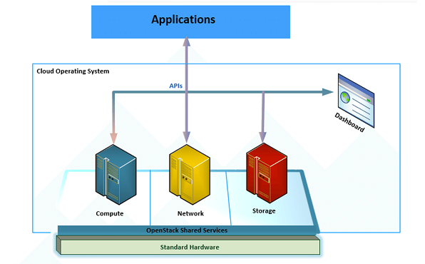
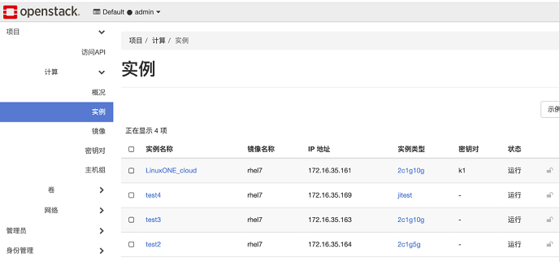

# LinuxOne-云最佳实践KVM笔记
学习IBM官方云最佳实践视频做的笔记，视频地址：[LinuxONE高密度云最佳实践成长之路 (KVM版）](https://csc.cn.ibm.com/roadmap/index/e96159c6-cf9b-47cb-bb13-17cb5cecdaf7?eventId=)

IBM 官方红皮书：[RedbooksFront coverVirtualization Cookbookfor IBM Z Volume 5KVM](http://www.redbooks.ibm.com/redpieces/abstracts/sg248463.html?Open)

## KVM on LinuxONE 安装与管理
### KVM host 准备
KVM on LinuxONE 基本架构：
- 每台LinuxONE都内置了硬件虚拟化微码，无需任何软件的支持，即可把LinuxONE分成很多个分区，分区间报纸EAL 5+ 基本的安全等级
- 在分区内部，KVM作为软件实现的虚拟化扩展了LinuxONE的虚拟能力
- KVM由kernel模块KVM（虚拟处理器和内存）和运行在用户态的QEMU（虚拟网络和I/O）两部分构成
- 每个VM是KVM host的一个进程，每个VM的VCPU是属于这个进程的一个线程

KVM的管理方式：
- KVM可以通过libvirt组件进行方便的管理
- 大规模的资源管理一般是通过OpenStack来进行
- 少量的KVM可以通过virsh命令行或者图形界面Virt-Manager来管理
- Cockpit是基于web方式，比较轻量的一种管理方式

KVM host的版本要求：
- LinuxONE 从SUSE 12 SP1或RHEL 7.5-ALT之后支持Linux发行版的KVM
- 对RHEL，目前推荐RHEL 7.6-ALT或者RHEL8.1，建议打上最新的kernel fix
- 对SUSE，目前推荐SUSE12 SP4

#### KVM host 软件安装
以RHEL7.6-ALT为例，演示KVM在LinuxONE上的环境准备和使用：        
1）安装RHEL7.6-ALT，更新到最新的kernel补丁，设置操作系统的yum源；    
2）安装下面所示的KVM相关软件（包括基本软件，性能监控和管理软件）：
```
# yum install qumu-kvm libvirt virt-install \
libvirt-python virt-manager libvirt-client virt-top
```
3）安装完成后，可以启动libvirtd service，或者重启KVM host；    
4）如果要使用图形化界面对KVM管理，需要安装做梦软件的vncserver：
```
# yum install @gnome-desktop tigervnc-server
```
5）如果不适用图形界面，可以使用virsh-install来安装虚拟机，用virsh来管理虚机。

#### KVM 图形界面管理
以vnc为例
- 执行vncserver，设置好vnc password
- 用vnc client例如vncreviewer连接KVM host，
- 启动VMManager（Vitual Machine Manager）

### 创建和复制虚机
#### 创建虚拟机
图形化安装步骤如下：
- 将RHEL 7.6的IOS（注意：VM不用7.6-ALT版本）上传到KVM host /var/lib/libvirt/images目录下，这个目录是缺省存放VM镜像的地方，空间需要保持足够使用。
- 在Vitual Machine Manager中点击“New VM”开始创建
- 在“Use ISO image”选项中选择需要安装的ISO文件
- 选择虚机的内存大小和CPU数量
- 根据实际需求更改磁盘的大小
- 输入虚机的名字，修改网卡，如果没有特别要求，macvtap方式性能较好，用bridge方式接入到已有的一张网卡，
- 点击完成后，出现了安装画面，配置各项配置：时区，安装的软件包，分区划分，网络配置，root密码等
- 最后选择“begin install”后开始安装
- 等待安装完成，回车后虚机重启

&#8195;&#8195;还可以通过virt-install命令来安装虚拟机，直接使用virt-install命令即可，在命令中设置各项配置，命令示例如下：
```
# virt-install --name kvmtest01 --memory 2048 -vcpus 2 \
--disk path=/var/lib/libvirt/images/kvmtest01_vol001.img,size=10 \
--network network:macvtap-net \
--cdrom /var/lib/libvirt/images/RHEL-7.6-20181010.0-Server-s390x-dvd1.iso
```
说明：
- 如果写入了`size=10`表示新创建一个10G大小的磁盘
- 如果先创建好了磁盘，可以用`--import`方式来使用已有磁盘

&#8195;&#8195;虚机启动成功后，进入到安装界面，跟之前基本一样配置各项配置：时区，安装的软件包，分区划分，网络配置，root密码等。最后回车重启虚机即可。

#### Clone虚机
&#8195;&#8195;可以定义一个标准的模板，后面可以使用Clone方式快速得到新的分区，省掉每个虚机重新安装，打补丁安装软件的过程，步骤如下：
- 关掉要Clone的虚机
- 选择虚机，点击右键，选择Clone
- 填入虚机名称，选择磁盘设置，点击Clone及Clone完成

### 虚机的性能监控
&#8195;&#8195;KVM VM的性能监控可以使用virt-top命令，这个命令可以看到哪些分区消耗处理器或内存比较多。结合VM里的应用，确认是否有性能问题。virt-top是一个单独的rpm包，在安装KVM相关组件的时候建议安装上。

直接使用`virt-top`命令即可启用，主要内容：
- 磁盘的读和写情况
- 网络的接受和发送情况
- 虚机占用的处理器占整个虚机百分比情况
- 虚机占用的内存占整个虚机百分比情况

## 基于KVM的OpenStack解决方案
### OpenStack介绍以及应用场景
简介：
- OpenStack是一个开源的IaaS层云管理产品
- 距今已有10年历史，发布了已经有20多个版本
- 完全开源，得到了众多厂商的支持，功能愈来愈丰富和稳定
- OpenStack主要包含计算、网络和存储三大模块
- 用户通过一个portal管理计算、存储和网络资源
- 基于LinuxONE的OpenStack已经得到了社区的支持
- 在rdo网站上可以使packstack快速安装OpenStack
- 可以利益rdo提供的安装包，自行进行安装



云上应用场景：
- 公有云：OpenStack涉及初衷是服务于公有云，其中的租户设计伟公有云奠定了基础
- 私有云：OpenStack在中国市场大多作为企业内部私有云建设
- 混合云：OpenStack本身可以纳管KVM等虚拟化环境，作为混合云管理的工具

### OpenStack在LinuxONE上的解决方案
OpenStack分为计算节点和管理节点：
- 管理节点使用三个节点实现高可用，可安装在LinuxONE平台或X86平台，对计算节点进行管理
- 计算节点可以有多个，可按照在LinuxONE和X86平台

网络可分为管理、存储和业务网络。

### OpenStack在LinuxONE上的优势
OpenStack在LinuxONE上的优势：
- 更强的计算能力，管理更大规模的工作负载
    - LinuxONE拥有最快CPU，用于KVM或z/VM虚拟化常见可以提高须立即性能
    - 在同等CPU单位下，可以提供更多虚拟机，实现大规模工作负载和整合与管理
- 更高的存储性能，支持FC SAN协议
    - 通常X86的存储支持IP SAN，LinuxONE既支持IP SAN也支持FC SAN 存储
    - FC SAN 提供更低的时延、速度更快、更稳定
- 更强的扩展能力，包括横向扩展和纵向扩展
    - 当云平台的资源匮乏时，在LinuxONE上可以在线快速扩展计算节点
    - 当某个计算节点资源匮乏时，可以在线快速纵向扩展几点节点的计算资源

### OpenStack WEB界面示例
示例图如下：    


## 待补充
