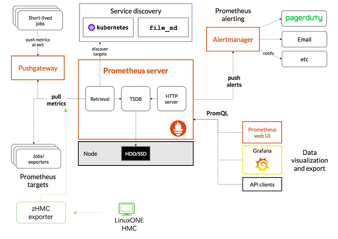
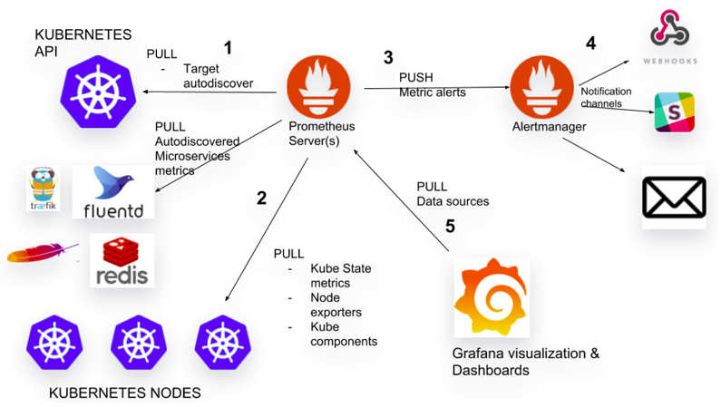
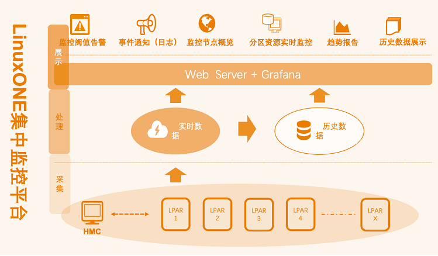

# LinuxONE-基于普罗米修斯的监控管理
&#8195;&#8195;学习IBM官方LinuxONE高密度云最佳实践视频做的笔记，内容基本摘自官方，结合上机实践步骤，整理成此文档方便查阅巩固知识。官方地址：[LinuxONE高密度云最佳实践成长之路 (KVM版）](https://csc.cn.ibm.com/roadmap/index/e96159c6-cf9b-47cb-bb13-17cb5cecdaf7?eventId=)

## Prometheus项目及架构介绍
Prometheus为CNCF的第二个毕业项目。
### LinuxONE环境的监控
主流监控产品对LinuxONE的支持：Zabbix和Prometheus。     
Zabbix简介：
- Zabbix是传统的监控，使用C和PHP语言编写，数据库使用关系数据库
- Zabbix是采用推送方式到server端
- Zabbix推荐监控传统环境

Prometheus简介：
- Prometheus，云原生监控系统，使用Go语言编写
- Prometheus采用抓取方式
- Prometheus推荐部署在云环境，容器平台等

### Prometheus基本架构
Prometheus基本架构图：    
     
数据采集（exproters/jobs）：
- Prometheus Server将部署在目标上的exproters/jobs暴露出来的metrice采集到（Pull）到时许数据库中
- TSDB是Prometheus定制的时序数据库，存储在本地磁盘
- Prometheus可以对抓取的数据进行高效压缩

服务发现（Service discovery）：
- 监控目标多的时候，可以自动化抓取监控目标
- 支持主流服务发现机制，例如kubernetes

数据可视化：
- Prometheus WEB UI一般用作配置管理，查询或者调试，一般不用与监控数据的可视化
- Grafana是单独开源项目，通过Grafana的看板，将数据信息在可视化界面中展现，实现资源状态的监控
- 支持API clients，可以通过Prometheus server通过查询语言接入到自定义的管理界面
- 提交的查询给时序数据库，然后在Grafana可视化，查询通过PromQL查询语言，是Prometheus自己的查询语言

事件告警（Prometheus AlertManager，Grafana Alert/Notification）：
- 根据定义的告警规则，对接受的警告进行处理，发出事件告警
- 支持pagerduty，Email以及企业微信

### 对监控目标的广泛支持-Exporters/客户端开发库
对监控目标的广泛支持：
- Prometheus通过Exporter采集被监控目标的监控数据（Metrice）
- Prometheus项目同时提供官方（official）的exprotes：
    - GitHub链接：[https://github.com/prometheus](https://github.com/prometheus)
    - Prometheus官方exporters一般都提供s390x二进制安装包
- Prometheus官网同时提供第三方的exporters：
    - 官方链接：[http://prometheus.io/docs/instrumenting/exporters/](http://prometheus.io/docs/instrumenting/exporters/)
    - 第三方exporters可能不提供s390x版本，需自行编译后运行在LinuxONE平台
- 使用Prometheus的开发库可以定制化开发exproters：
    - 现有的exporters无法满足需求
    - 需要监控用户应用的特有目标
    - 官方和第三方提供了多种语言开发库，链接：[http://prometheus.io/docs/instrumenting/clientlibs/](http://prometheus.io/docs/instrumenting/clientlibs/)

### Prometheus的可扩展性及高可用
Federation联邦机制：
- Federation运行一个Prometheus server从另一个Prometheus server获取metrice

监控集群：
- 通过Federation搭建监控集群，实现监控平台的高可用和扩展性

多级部署：
- 通过Federation进行多级部署，可提供聚合的全局监控视图和本地视图

### Prometheus用于容器平台的监控
Prometheus用于容器平台的监控：
- Prometheus已经成为容器平台监控的标准，被广泛用于Kubernetes集群监控
- Prometheus + Grafana是Kubernetes集群监控系统的重要组成部分

Prometheus用于容器平台的监控图示：     
  

### Prometheus用于OpenShift容器平台的监控
Prometheus用于OpenShift容器平台的监控：
- OCP内置了Prometheus组件
- OCP缺省使用Prometheus，Grafana监控Cluster运行状态
- RedHat不建议使用内置的Prometheus监控框架监控用户metrice，如需针对应用服务进行监控，可以单独部署所需的集中监控实例

## LinuxONE集中监控方案及服务介绍

### LinuxONE集中监控方案功能概览
LinuxONE集中监控方案功能概览：     
      
全栈集中监控：
- LinuxONE整机--Lpar--Linux--Application
- 虚拟机--容器--service--IT Infrastructure
- 使用Grafane进行图形化展示

### LinuxONE集中监控方案服务提供
LinuxONE集中监控方案服务提供：
- 架构设计：弹性的架构涉及，监控系统容量规则，高可用涉及
- 安装部署：容器化或非容器化监控环境部署，自动化采集端部署及服务发现配置
- 数据收集：Prometheus Exporters在LinuxONE平台上的部署及定制，例如Libvirt,Oracle,SNMP,zHMC,hyptop,Process等
- 数据存储：可定制的存储方案，支持不同时效性的监控需求和历史数据存储及查询
- 数据展示：客户化数据展示方式，Grafana dashboard定制开发
- 事件报警：客户化的报警机制，可以通过邮件、微信等方式报警以及报警策略的设计定制

## 监控图示及Demo
### LinuxONE监控示例
#### 服务器集中监控界面
&#8195;&#8195;将多台LinuxONE整机的CPU使用率集中在Grafana的一张图中显示，实现集中显示，数据来源基于hyptop命令输出，图示如下：    
     

#### 分区监控界面
&#8195;&#8195;LinuxONE Lpar资源使用情况，数据来源是hyptop collector，可以快速定位需要关注的逻辑分区，发现异常后可进一步分析具体操作系统或应用，图示如下：     
     

#### 操作系统监控
&#8195;&#8195;数据来源是Prometheus Node Exproter，可以进一步分析操作系统运行情况，图示如下：   
    

### 监控目标自动化部署及服务发现
监控目标自动化部署及服务发现：
- 监控目标自动化部署（Ansible）及服务发现
- 服务发现（SD）主要用于大规模环境部分，Prometheus支持多种服务发现方式：[https://github.com/prometheus/prometheus/tree/master/discovery](https://github.com/prometheus/prometheus/tree/master/discovery)

最简单基于文件的SD作为示例解释服务发现机制：      
prometheus.yml文件：
```yml
# A scrope configuration containing exactly one endpoint to scrape:
# Here it's Prometheus itself.
scrope_configs:
    # The job name is added as a label `job=<job_name>` to any timeseries scraped form this config.
    - job_name:file
        file_sd_configs:
        - files:
            - '*.json'
```
filesd.json文件：
```json
{
    {
        "targets": [ "localhost:9100" ],
        "labels":{
            "team": "infra",
            "job": "node"
        }
    },
    {
        "targets": [ "localhost:9090" ],
        "labels":{
            "team": "monitoring",
            "job": "prometheus"
        }
    }
}
```
### Alertmanager报警：企业微信
Alertmanager内置了对企业微信的支持，链接：[https://prometheus.io/docs/alerting/configuration/#wechat_config](https://prometheus.io/docs/alerting/configuration/#wechat_config)
### Alertmanager报警：邮件
&#8195;&#8195;Alertmanager支持email报警，灵活配置，内外可以通过配置邮件转发服务联系外网SMTO服务器进行报警邮件发送，链接：[https://prometheus.io/docs/alerting/configuration/#email_config](https://prometheus.io/docs/alerting/configuration/#email_config)
