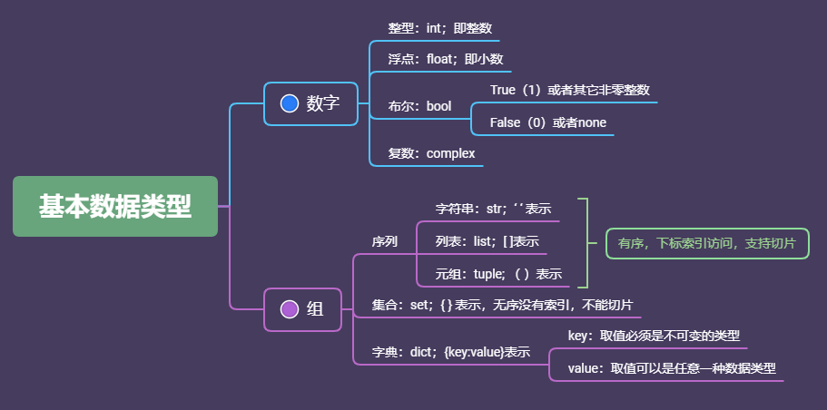

# Python学习笔记-基本数据类型

### 整形
##### 进制表达：
二进制：0b  八进制：0o  十六进制：0x
##### 进制转换
转换为二进制：
```python
>>> bin(10)
'0b1010'
>>> bin(0o10)
'0b1000'
>>> bin (0x10)
'0b10000'
```
转换为十进制：
```python
>>> int (0b111)
7
>>> int(0o111)
73
>>> int (0x111)
273
```
转换为八进制:
```python
>>> oct (0b11)
'0o3'
>>> oct (11)
'0o13'
>>> oct (0x11)
'0o21'
```
转换为十六进制:
```python
>>> hex(999)
'0x3e7'
>>> hex(222)
'0xde'
>>> hex(0b11)
'0x3'
```
##### 布尔和复数
bool 布尔类型：表示真（Ture)、假(False)
complex 表示复数
非空一般被认为True，空值一般被认为是False，除了0，当然None也可以表示Flase
```python
>>> int (True)
1
>>> int (False)
0
>>> type (True)
<class 'bool'>
>>> type (False)
<class 'bool'>
>>> bool (0)
False
>>> bool (4)
True
>>> bool (-1)
True
>>> bool (0)
False
>>> bool(4)
True
>>> bool(0x10)
True
>>> bool(0o0)
False
>>> bool ('qwer')
True
>>> bool ('')
False
>>> bool ([4,2])
True
>>> bool ([])
False
>>> bool ({2,3})
True
>>> bool ({})
False
>>> bool (None)
False
```
复数表示用j表示，例如：
```python
>>> 49j
49j
```
### str字符串
表示方式，单引号、双引号、三引号，数字在使用引号后，类型会发生改变；双引号可以区别英文中的单引号，加反斜杠（转义字符）也可以进行区分：
```python
>>> type (10)
<class 'int'>
>>> type ('10')
<class 'str'>
>>> "hello"
'hello'
>>> type ('hello')
<class 'str'>
>>> "I'm Iron Man"
"I'm Iron Man"
>>> type ("I'm Iron Man")
<class 'str'>
>>> 'I\'m Iron Man'
"I'm Iron Man"
```
对于比较长的字符，需要换行的话，可以用三引号（三个单引号或者三个双引号都可以）来换行，输出结果中\n表示回车，输入过程中有敲击回车的动作，反向使用\n不能显示换行，会认为是字符串一部分，用print函数可以显示换行效果：
```python
>>> '''I am Iron Man!
I am Iron Man!'''
'I am Iron Man!\nI am Iron Man!'
>>> 'I am Iron Man!\nI am Iron Man!'
'I am Iron Man!\nI am Iron Man!'
>>> '''I am Iron Man!\nI am Iron Man!'''
'I am Iron Man!\nI am Iron Man!'
>>> print ('I am Iron Man!\nI am Iron Man!')
I am Iron Man!
I am Iron Man!
```
一定要用单引号也是可以的，在字符串中加入\ 然后再回车换行即可继续输入：
```python
>>> 'I am \
Iron Man!'
'I am Iron Man!'
```
##### 转义字符
表示一些特殊的字符：
与语言本身语法有冲突的字符，或者看不见的字符：
\'        单引号
\n        换行符
\t        横向制表符
\r        回车
转义字符也有冲突的时候，例如如下面\n被当作换行符了，实际上它是目录的一部分，我们可以通过再加\去区分，或者在字符前加r，加r后，这样表示后面字符这不是一个不通字符，而是一个原始字符串
```python
>>> print ('d:\normal\work')
d:
ormal\work
>>> print ('d:\\normal\work')
d:\normal\work
>>> print (r'd:\normal\work')
d:\normal\work
```
##### 字符串的基本操作
经常需要对字符串进行操作，例如合并两个字符串或者字符串里面取其中一个字符，
字符串的运算，相加是最简单的，乘以数字会输出两遍，但是字符串乘以字符串是不行的：
```python
>>> 'I am '+'Iron Man!'
'I am Iron Man!'
>>> 'I am Iron Man!'*2
'I am Iron Man!I am Iron Man!'
```
字符串的提取单个字符：
从零开始，正数就是从前往后数，负数就是从后往前；字符中有转义字符不算
```python
>>> 'I am Iron Man!'[0]
'I'
>>> 'I am Iron Man!'[3]
'm'
>>> 'I am Iron Man!'[1]
' '
>>> 'I am Iron Nan!'[-1]
'!'
>>> 'I\'m Iron Man!'[2]
'm'
```
字符串的提取多个字符：
截取到第n位字符，需要输入下一个序号，即n+1,倒数可以用负数，但是负数不能截取到最后一位，冒号后面不输入，就默认截取到最后；冒号前面不输入，就默认从头开始截取：
```python
>>> 'I am Iron Man!'[5:14]
'Iron Man!'
>>> 'I am Iron Man!'[5:-1]
'Iron Man'
>>> 'I am Iron Man!'[5:]
'Iron Man!'
```
如果字符比较长，只需要最后的几位，不可能从头开始数，可以从后面开始数，然后截取此位数后面的内容：
```python
>>> 'I am Iron Man!'[-4:-1]
'Man'
>>> 'I am Iron Man!'[-4:]
'Man!'
```
### 列表list
例如`[1,2,3,4,5]`;`['I', 'am','Iron','Man',1,2,True]`;以及嵌套列表：`[[True,3],[False,2],[3,4]]`，查看类型如下：
```python
>>> type ([1,2,3,4,5,6])
<class 'list'>
>>> type (['I','am','Iron','Man',1,2,True])
<class 'list'>
>>> type ([[True,3],[False,2],[3,4]])
<class 'list'>
```
列表截取，和字符串截取基本一致：
```python
>>> ['I','am','Iron','Man','!'][2]
'Iron'
>>> ['I','am','Iron','Man','!'][-1]
'!'
>>> ['I','am','Iron','Man','!'][1:3]
['am', 'Iron']
```
##### 列表操作
相加就是合并，但是不能减，乘也只能乘以数字，会重复数组，除法当然不行
```python
>>> ['I','am']+['Iron','Man','!']
['I', 'am', 'Iron', 'Man', '!']
>>> ['Thanos']*2
['Thanos', 'Thanos']
```
嵌套列表
```python
>>> [['Thanos','Loki'],['Hulk','Thor'],['Captain America']]
[['Thanos', 'Loki'], ['Hulk', 'Thor'], ['Captain America']]
```
### 元组tuple
例如：(1,2,3,4,5,6);(1,'-2',False,True),元组的操作和列表一样
```python
>>> (1,2,3,4)+(5,6)
(1, 2, 3, 4, 5, 6)
>>> (1,2,3)*2
(1, 2, 3, 1, 2, 3)
>>> (1,'Thanos',True)[1]
'Thanos'
>>> type ((1,2,3))
<class 'tuple'>
```
当单元素的元组的时候，type认为类型不一样，因为python里面括号也表示一个运算符号，例如（1+3）*3，所以单元素的时候会认为是个数学运算符号，单元素在后面加上一个逗号，即可识别为元组：
```python
>>> type((1))
<class 'int'>
>>> type(('Thanos'))
<class 'str'>
>>> type((1,))
<class 'tuple'>
>>> type(('Thanos',))
<class 'tuple'>
>>> type(())
<class 'tuple'>
```
### 序列总结
str  list tuple都属于序列，序列里面每一个元素都有一个序号
序列的加减和乘用法都一致，序列的截取元素的方法也一致：
```python
>>> 'I am Iron Man!'[3]
'm'
>>> ['I','am','Iron','Man','!'][2]
'Iron'
>>> (1,'Thanos',True)[1]
'Thanos'
```
##### 序列切片操作
前面有提到过，用到了两个数字，其实可以多个数字进行切片操作
```python
>>> ['I','am','Iron','Man','!'][1:3]
['am', 'Iron']
>>> 'I am Iron Man!'[0:8:3]
'Imr'
```
##### 运算符号
in判断某个元素是否在列表或者字符中：
```python
>>> 'Thanos' in ['Iron Man','Captain America','Thor','Thanos']
True
>>> 'Thanos' in ['Iron Man','Captain America','Thor']
False
>>> 'Thanos' not in ['Iron Man','Captain America','Thor','Thanos']
False
```
序列元素统计 len
序列取最大元素 max
序列取最小元素 min
对于字母也有大小之分，是根据ascll码来排序：
```python
>>> len (['Captain America','Thanos','Thor'])
3
>>> max ([1,3,4,6,8])
8
>>> min ([4,6,8,2,5])
2
>>> max ('I am Iron Man!')
'r'
>>> min ('I am Iron Man!')
' '
>>> min ('Thanos')
'T'
```
ord参数查看ascll码 ：
```python
>>> ord ('T')
84
>>> ord ('t')
116
```
### 集合set
集合的特点：无序，所以不能用序列的截取和切片方法
集合的定义：{   }
集合的特性：不重复，元素中重复的元素会被忽略
支持操作：len、in、not in、逻辑运算
```python
>>> type({1,'Thanos','Thor',4,9})
<class 'set'>
>>> {1,1,'Thanos','Thor','Thanos',3,5,3,'Thor'}
{1, 3, 5, 'Thanos', 'Thor'}
>>> len({1,1,'Thanos','Thor','Thanos',3,5,3,'Thor'})
5
>>> 'Thanos' in {1,1,'Thanos','Thor','Thanos',3,5,3,'Thor'}
True
```
##### 集合运算
两个集合的差集：-
两个集合的交集：&      寻找两个集合里面共有的元素
两个集合的合集：|        合并两个集合，并且排除重复的元素
```python
>>> {1,'Thanos','Thor','Hukl'}-{'Thanos'}
{1, 'Thor', 'Hukl'}
>>> {1,'Thanos','Thor','Captain America'}&{'Captain America'}
{'Captain America'}
>>> {1,'Thanos','Thor','Hulk','Captain America'}|{'Thor','Iron Man','Hulk'}
{1, 'Thor', 'Captain America', 'Iron Man', 'Thanos', 'Hulk'}
```
##### 空集合
用set()来定义一个空的集合
```python
>>> set()
set()
>>> type (set())
<class 'set'>
>>> len (set())
0
>>> {1,'Thanos','Thor'}&{'Captain America'}
set()
```
### 字典dict
字典也是一种集合,通常有Key 和Value两个关键字
基本定义方式：`{key1:value1,key2:value2,key3:value3...}`
```python
>>> type({'T':'Thanos','1':'11','C':'Captain America','I':'Iron Man'})
<class 'dict'>
```
##### 字典的操作
可以通过key来截取字典字段
字典中不能出现重复的key，重复的会被忽略
对于数字 1 和字符'1'会被识别为不同的key
key取值必须是不可变的类型：int、str、tuple
value取值可以是任意一种数据类型：str、int、folat、list、set、dict
```python
>>> {'T':'Thanos','1':'11','C':'Captain America','I':'Iron Man'}['T']
'Thanos'
>>> {'T':'Thanos','C':'Captain America','T':'Thor','I':'Iron Man'}['T']
'Thor'
>>> {'T':'Thanos','C':'Captain America','T':'Thor','I':'Iron Man'}
{'T': 'Thor', 'C': 'Captain America', 'I': 'Iron Man'}
>>> type ({(1,2):'Thanos','C':'Captain America'})
<class 'dict'>
```
### Python基本数据类型总结
利用一个思维导图进行总结：

