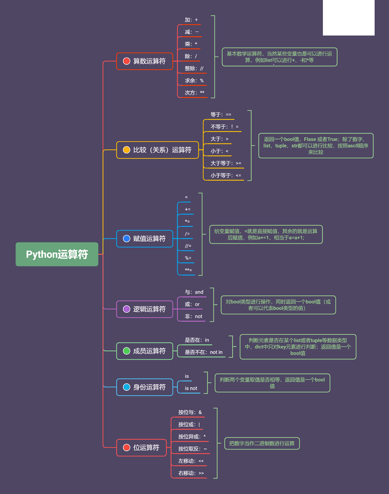

# Python学习笔记-变量与运算符

### 变量
##### 变量定义
定义采用赋值符号：=
变量名命令可以为字母、数字、下划线的组合，但是变量名的首字符不能为数字；
变量名区分大小写；
可以将数字，字符，序列，集合赋值给变量；
系统保留的关键字是不能使用在变量名中，例如and、if、import。虽然type、print可以作为变量名，但是使用会发生冲突，不建议使用：
```python
>>> a=['Thanos'];b=['Hulk']
>>> print (a)
['Thanos']
>>> a*2+b+a
['Thanos', 'Thanos', 'Hulk', 'Thanos']
```
在赋值中，int 、str、tuple（不可变）类型称为值类型，list 、set、dict（可变）类型称为引用类型
值类型中，改变a的赋值后b的值没有改变
```python
>>> a=1; b=a; a=3
>>> print(b)
1
```
在引用类型中，更改了列表中的某一个元素，b所赋的值也会发生改变
```python
>>> a=['Thor','Iron Man','Captain America']
>>> b=a;a[0]='Thanos'
>>> print(b)
['Thanos', 'Iron Man', 'Captain America']
```
两个字符串相加有得到了一个新的字符串，但是不可以像刚才改变list元素一样取改变字符内容，例如：
```python
>>> a='I am '; a=a+'Iron Man'
>>> print(a)
I am Iron Man
>>> a[0]='i'
Traceback (most recent call last):
  File "<pyshell#28>", line 1, in <module>
    a[0]='i'
TypeError: 'str' object does not support item assignment
```
##### tuple和list赋值的区别
id函数可以查看变量内存地址，可以看到将list赋值给a后，改变a的元素，内存地址没变；
当把tuple赋值给a后，里面元素是不可改变的；例如下面修改：
```python
>>> a=['Thor','Iron Man','Captain America']
>>> id(a)
2633689218048
>>> a[0]='Thanos'
>>> id(a)
2633689218048
>>> a=('Thor','Iron Man','Captain America')
>>> a[0]='Thanos'
Traceback (most recent call last):
  File "<pyshell#34>", line 1, in <module>
    a[0]='Thanos'
TypeError: 'tuple' object does not support item assignment
```
如果想避免修改，建议用tuple去赋值，如果想动态修改，建议用list去赋值。例如下面的增加元素：
```python
>>> a=['Thor','Iron Man','Captain America']
>>> a.append('Hulk')
>>> print(a)
['Thor', 'Iron Man', 'Captain America', 'Hulk']
>>> a=('Thor','Iron Man','Captain America')
>>> a.append('Hulk')
Traceback (most recent call last):
  File "<pyshell#39>", line 1, in <module>
    a.append('Hulk')
AttributeError: 'tuple' object has no attribute 'append'
```
##### 访问和修改变量中的多维元素
例如下面二维tuple
```python
>>> a=('Thor','Iron Man','Captain America',['Thanos','Loki'])
>>> print(a[3])
['Thanos', 'Loki']
>>> a[3][0]
'Thanos'
```
如果是一维的tuple，不可修改，刚才试过了，但是tuple中二维元素是list，可以修改list中的元素：
```python
>>> a=('Thor','Iron Man','Captain America',['Thanos','Loki'])
>>> a[0]='THOR'
Traceback (most recent call last):
  File "<pyshell#45>", line 1, in <module>
    a[0]='THOR'
TypeError: 'tuple' object does not support item assignment
>>> a[3][0]='THANOS'
>>> print(a)
('Thor', 'Iron Man', 'Captain America', ['THANOS', 'Loki'])
```
### 运算符
基本算数运算符：+（加） 、-（减）、*（乘）、/ （除）、//（整除）、%（求余）、**（次方）；
赋值运算符：=、+=、*=、/=、%=、**=；
比较（关系）运算符：==、!=、>、<、>=、<=;
逻辑运算符：and（与）、or（或）、not（非）；
成员运算符：in(是否在)、not in*(是否不在);
身份运算符：is、is not;
位运算符：&(按位与)、|(按位或)、^(按位异或)、~(按位取反)、<<(左移动)、>>(右移动)。
##### 赋值运算符
a=a+1可以简写成a+=1;b=b-1可以简写成b-=1;b=b*a可以简写成b*=a;依此类推
```python
>>> a=1; a=a+1
>>> print(a)
2
>>> a=1;a+=1
>>> print(a)
2
```
##### 比较运算符
两个变量间进行比较，各种数据类型都可以比较，比较后会返回一个bool值。
字符比较会根据ascll码来比较，多个字符依次开始比较：
```python
>>> 'Thanos'=='Thanos'
True
>>> ['Thanos','Loki']!=['Thanos','Loki']
False
>>> 'a'>'b'
False
>>> 'Thanos'>='Thor'
False
>>> ord('a');ord('b')
97
98
```
下面示例中a>=1返回True，然后在进行赋值运算，bool类型True可以相当于数字1，故可以进行数学运算：
```python
>>> a=1；a+=a>=1
>>> print(a,a>=1)
2 True
```
##### 逻辑运算符
操作的是类型是bool类型，返回值也是bool类型：
```python
>>> True and True;False and True;False or True;not False
True
False
True
True
```
对于int或者float，0被认为是Fales，非0被认为True；
对于str，空值为False，非空的为True；
对于list，空列表为False，非空为True；
对于tuple、set和dict一样遵循这样规则，反馈的不是直接bool值，只需要关注返回的元素代表的是False还是True：
```python
>>> 'Thanos'and'Thor';'Thanos'or'Thor';not 'Thaons'
'Thor'
'Thanos'
False
>>> ['Thanos']or[];[]or['Thor']
['Thanos']
['Thor']
```
##### 成员运算符
判断元素是否在某个list或者tuple等数据类型中，dict中只对key元素进行判断；返回值是一个bool值：
```python
>>> >>> a='Thanos'
>>> a in ['Thor','Thanos','Hulk','Captain America']
True
>>> a='Thanos';b='T'
>>> a in {'T':'Thanos','H':'Hulk','C':'Captain America'}
False
>>> b in {'T':'Thanos','H':'Hulk','C':'Captain America'}
True
```
##### 身份运算符
判断两个变量取值是否相等，返回值是一个bool值；
和关系运算符==的区别是，==比较的是两个变量的值是否相等，is比较的是两个变量的身份（内存地址id）是否相等：
```python
>>> a='Thor';b='Thanos';
>>> a is not b
True
>>> a=1;b=1.0
>>> a is b;a==b
False
True
```
对于序列：str；tuple和list这种有序的数据，必须按照顺序，而对于集合set无序的数据，不在乎顺序：
```python
>>> a=['Thanos','Iron Man','Thor'];b=['Iron Man','Thor','Thanos']
>>> a is b;a==b
False
False
>>> a={1,2,3};b={2,1,3}
>>> a==b;a is b
True
False
>>> a={'Thanos','Tron Man','Thor'};b={'Thanos','Tron Man','Thor'}
>>> a==b;a is b
True
False
>>> id (a)
2633689392064
>>> id (b)
2633689391840
>>> a=('Thanos','Tron Man','Thor');b=('Thanos','Tron Man','Thor')
>>> a==b;a is b
True
True
```
##### 类型判断
对象三个特征：值、身份、类型
例如判断某个变量是否是字符str，在python也可以用isinstance函数进行判断，也可以多个判断标准，满足一个就行了：
```python
>>> a=['Captain America']
>>> type (a)==str
False
>>> isinstance (a,list)
True
>>> isinstance(a,(str,float,set,tuple))
False
>>> isinstance(a,(str,float,set,tuple,list))
True
```
##### 位运算符
按位与用图例解释，下图是按位与&的运算方法：


按位或 | 运算就是只要有一个为1，就得到结果为1，所以2和3比较就是3：
```python
>>> a=2;b=3
>>> a&b;a|b
2
3
```
### Python变量与运算符总结
同样利用一个思维导图进行总结：

