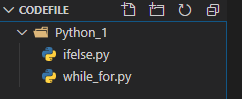
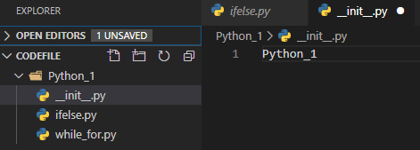
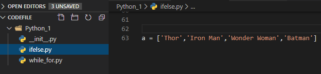
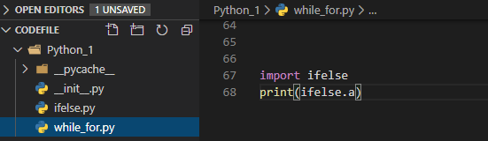
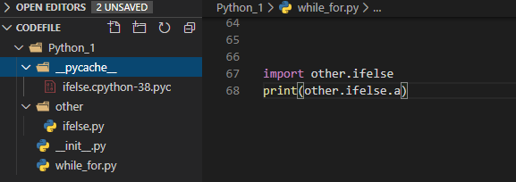

# Python学习笔记-组织结构_包和模块
### Python项目的组织结构 
对于比较复杂的项目，需要有完整的组织结构来对代码进行分类管理和组织代码
包：可用理解为文件夹
模块：可以理解为文件
类：
函数、变量
一个包下面可以包含多个模块（也可以有子包），一个模块下面可以有多个类（或者函数和变量），一个类下面可以有多个函数和变量
##### Python项目的组织结构 
如下所示Python_1就是包的名字，ifelse.py代表一个模块那么ifelse就是模块的名字

如果不同的包里面有相同名字的模块，需要区分可以在模块的前面加上包的名字，例如Python_1.ifelse，形成了一个路径，这种方法叫命名空间；

如果想让一个文件夹成为一个包，需要在包下面有一个特定的文件：__init__.py，同样算一个模块，可以空着，也可以编辑代码。这块模块的名字就是包名：Python_1

### Python模块也变量引用
##### import导入方式
一个项目一般是多个包和多个模块之间的相互调用构成的，在其中一个模块里面定义了一个变量，可以在另外一个模块中使用，不需要重复定义，例如在ifelse.py中定义a：

在while_for.py中引用变量a，用import函数，如果ifelse.py 和while_for.py是同一级别，输入模块名即可：

运行输出结果：
```shell
PS D:\Python\codefile\Python_1> python while_for.py
['Thor', 'Iron Man', 'Wonder Woman', 'Batman']
```
如果不是同级别，需要加上完整路径，及包名字，命名规则和之前一样：

运行输出结果和之前一样。我们在运行过程中，可以看到自动生成了__pycache___包，并且下面有一个pyc文件，是一个二进制文件，是python自动生成的字节码，可以提升python程序运行的效率。

improt导入的是一个模块，不能直接导入一个模块的变量，引入模块变量时候就需要:模块名.变量名
如果模块名特别长或者路径特别长，可以采用如下方法：
```python
import other.ifelse as m
print(m.a)
```
运行结果和之前一样，把模块名简化成一个字母。
##### form导入
结构如下：
from module（或者包） import a（可以是变量或者函数，如前面是包，这里也可以是模块）
同样是上面示例，在包Python_1的while_for模块中，从子包other包的模块ifelse模块中引用a：
```python
from other.ifelse import a
print(a)
```
执行后输出结果和之前一致。

如果想导入所有的变量，可以用"*"来代替：
```python
from other.ifelse import *
print(a)
```
执行后输出结果和之前一致。

如果需要导入很多变量，但是也不是需要全部的，可以用__all__（在Python叫模块内置变量，模块内置属性）来指定。在子包other包的模块ifelse中定义如下三个变量，
```python
__all__ = ['a','c']
a = ['Thor','Iron Man']
b = ['Wonder Woman','Batman']
c = ['Captain America','Hulk']
```
然后在包Python_1的while_for模块中进行引用：
```python
from other.ifelse import *
print(a)
print(b)
print(c)
```
运行输出结果：
```shell
PS D:\Python\codefile\Python_1> python while_for.py
['Thor', 'Iron Man']
Traceback (most recent call last):
  File "while_for.py", line 78, in <module>
    print(b)
NameError: name 'b' is not defined
```
可以看到只输出了a的值，并且有报错说b没有定义，报错后后面的代码也不会继续执行了。

如果想全部引用，出了使用“*”，还可以直接输入，用逗号隔开：
```python
from other.ifelse import a,b,c
print(a)
print(b)
print(c)
```
如果导入的变量特别多，一行写不下，太长了也不好看，可以在末尾加上“\"进行代码换行:
```python
from other.ifelse import a,b,\
c
print(a)
```
也可以用括号强制换行,一般推荐这种方式：
```python
from other.ifelse import (a,b,
c)
print(a)
```
##### __init__作用
基本作用是当一个包被导入的时候，__init__会自动首先执行：
例如在子包other的__init__模块中写入如下代码：
```python
d = ['Thor','Captain America','Iron Man']
print(d)
```
然后在主包Python_1的while_for模块中调入子包other模块中a，while_for中代码如下:
```python
from other.ifelse import a
print(a)
```
运行输出结果：
```shell
PS D:\Python\codefile\Python_1> python while_for.py
['Thor', 'Captain America', 'Iron Man']
['Thor', 'Iron Man']
```
可以看到__init__模块中代码会自动首先执行。
##### __init__应用场景
在__init__模块里面可以通过__all__来决定哪些模块可以被导出。
方便试验，首先在other中新建两个模块code1.py和code2.py：
然后在code1.py里面定义几个变量：
```python
a = ['Thanor']
b = ['loki']
```
code2.py中定义几个变量：
```python
c = ['Thor','Hulk']
d = ['Captain America']
```
在__init__.py中输入如下代码，意思是只让调用code1中的内容：
```python
__all__ = ['code1']
```
然后在Python1主包下面建立个模块code_1.py，输入如下代码，即导入所有变量：
```python
from other import *
print(code1.a)
print(code2.d)
```
运行输出结果：
```shell
PS D:\Python\codefile\Python_1> python code_1.py
['Thanor']
Traceback (most recent call last):
  File "code1.py", line 3, in <module>
    print(code2.d)
NameError: name 'code2' is not defined
```
可以看到只输出了code1中的a，而code2认为没有定义。

__init__还可以用作批量导入
在Python1主包下面模块code_1.py中定义如下系统预定模块：
```python
import sys
import datatime
import io
print(sys.path)
```
执行可以打印出系统存储这些模块的路径。如果Python1下面很多模块需要引用这写系统预定模块，每个都写就很不方便，那么可以在子包other中的__init__模块中输入导入代码：
```python
import sys
import datatime
import io
```
然后再Python1主包下面模块code_1.py调用other包中的元素，就会先执行other下的__init__模块中的内容：
```python
import other
print(other.sys.path)
```
路径也是要写全，执行后输出结果就和刚才一样，这种一般用在很多个模块导入操作。

包和模块是不会重复导入的
也不建议循环引用，例如other包中code1.py中应用 code2.py中的变量，然后再code2.py中引入 code1.py的变量

Python中导入一个模块，就会执行导入模块中的代码：
例如在code_1.py中输入定义变量和打印操作：
```python
a = ['Wonder Woman','Batman']
print(a)
```
然后在code_2.py中只导入模块code1.py，不作打印操作：
```python
import code1
```
运行code_2.py执行结果如下：
```shell
PS D:\Python\codefile\Python_1\other> python code2.py
['Wonder Woman', 'Batman']
```
可以看到还是有打印输出内容，说明执行了code1.py中的内容。
上面示例中code_2.py相当于一个入口文件，通常一个应用程序中只有一个入口文件。
