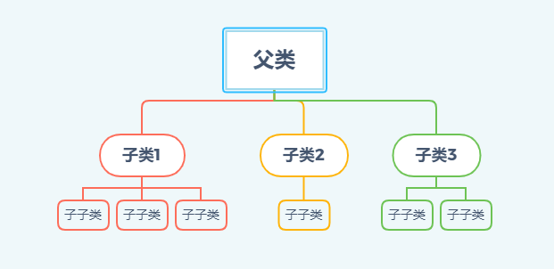
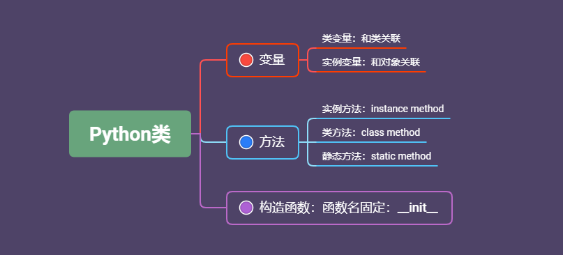

# Python学习笔记-面向对象
最核心的内容：类，对象
### 类
类是现实世界或思维世界中的实体在计算机中的反映，它将数据以及这些数据上的操作封装在一起。
类的基本作用是去封装一系列的函数和一系列的变量
在Python中用关键字class来定义一个类
类的格式如下：
```python
class classname(object):
    pass
```
classname：定义类的名字建议第一个字母大写，如果类由两个单词组成，不建议用下划线来连接，建议两个单词首字母大写。
object：类的参数
pass：空语句，占位语句，可以编写任意代码。可以定义若干个变量，还可以定义函数。

新建一个包object，新建一个模块module_1.py，在此模块中进行示例：
```python
class SuperHero():
    name = 'Thor'
    form ='Asgard'
    def print_hero(self):
        print('My name is ' + self.name)
        print('I am come form ' + self.form)
superhero = SuperHero()
superhero.print_hero()
```
运行输出结果：
```shell
PS D:\Python\codefile\object> python module_1.py
My name is Thor
I am come form Asgard
```
注意事项 
- 要使用类，就需要将类实例化，实例中superhero=SuperHero()就是将类实例化操作；
- 在类中的函数，模块参数必须加上self，在函数中调用类中的变量，需要加上路径，例如示例中self.name； 
- 运行和调用类需要放在类的外部，在类内部调用函数会报错。
#### 在其它模块调用类
新建一个module_2.py，在里面调用module_1.py中的类，先封装module_1.py实例化和调用的操作，然后在module_2中输入如下代码：
```python
from module_1 import SuperHero
superhero = SuperHero()
superhero.print_hero()
```
运行输出结果：
```shell
PS D:\Python\codefile\object> python module_2.py
My name is Thor
I am come form Asgard
```
在Python中，这种调用类中的函数通常叫调用类中的方法：
格式如下：
```python
class classname(object):
    pass
    def funcname(self, parameter_list):
        pass
```
### 类与对象
类进行实例化之后，就变成了一个具体的对象；
类就像一个模板，通过模板可以产生很多对象；
上面示例中，superhero = SuperHero()就是进行了实例化，superhero就是一个对象，还可以继续实例化，例如superhero1 = SuperHero()，当然我们得到superhero1输出结果会跟superhero一样，但是他们是两个不同的对象，在计算机中的内存地址也不一样。
```python
class SuperHero():
    name = 'Thor'
    form = 'Asgard'
    def print_hero(self):
        print('My name is '+ self.name)
        print('I am come form ' +self.name)
superhero = SuperHero()
superhero1 = SuperHero()
superhero.print_hero()
superhero1.print_hero()
```
#### 构造函数
如何向类传递不同的参数，从而生成不同的对象，需要在类的内部定义一个特殊的函数，叫构造函数：
格式如下：
```python
class classname(object):
    pass
    def __init__(self):
        pass
```
函数名是固定的：__init__，函数的形式参数也必须有一个参数，可以自定义，一般建议用：self；
构造函数的调用是自动进行的，当进行实例化时候，会自动调用，当然用户也可以手动调用，但是实际很少这样做；
构造函数，不能随便return一个除None的值。
初始化对象的属性，下面示例中name = name就是初始化对象的属性；
superhero = SuperHero('Thor','Asgard')就是给类传递参数：
```python
class SuperHero():
    name = ''
    home = ''
    def __init__(self,name,home):
        name = name
        home = home
superhero = SuperHero('Thor','Asgard')
print(superhero.name)
```
执行输出结果如下：
```shell
PS D:\Python\codefile\object> python module_2.py

```
可以看到是一个空字符，说明上面的代码有问题，得不到我们想要的结果，其实打印出来的是类变量，即name=''。
在函数中，如果在函数中定义了一个和全局变量同名的局部变量，局部变量不会覆盖全局变量。
在类中，需要理解两个变量：类变量，实例变量
#### 类变量与实例变量
类变量只是和类关联，实例变量和对象相关联的
下面面示例中，name='Iron Man'就是类变量，在self.name = name 就是实例变量，superhero1 = SuperHero('Thor','Asgard')就是给实例变量传递参数，
```python
class SuperHero():
    name = 'Iron Man'
    home = 'Earth'
    def __init__(self,name,home):
        self.name = name
        self.home = home
superhero1 = SuperHero('Thor','Asgard')
superhero2 = SuperHero('Batman','Earth')
print(superhero1.name)
print(superhero2.name)
print(SuperHero.name)
print(superhero1.__dict__)
```
执行后输出结果：
```shell
PS D:\Python\codefile\object> python module_1.py
Thor
Batman
Iron Man
{'name': 'Thor', 'home': 'Asgard'}
```
可以看到superhero1.name 和superhero2.name值不一样，同样和类SuperHero.name值不一样，对于类变量，只和类相关，不受实例变量影响。

再回到之前打印为空字符的那断程序，其实打印出来的是类变量，即name=''，如果尝试访问一个实例变量，Python首先会在对象的实例变量中查找，如果没有，Python会继续在类变量中寻找。在构造函数中，name = name 没有给实例变量进行赋值，需要通过self.name = name 才是给实例变量进行了赋值。

Python中有一个变量：__dict__，输出结果是个字典。可以通过superhero1.__dict__，查看对象superhero1中保存的所有相关的变量

上面示例中可以print(SuperHero.__dict__)打印所有类中的变量：
输出结果如下：
```shell
PS D:\Python\codefile\object>python module_1.py
{'__module__': '__main__', 'name': 'Iron Man', 'home': 'Earth', '__init__': <function SuperHero.__init__ at 0x00000168664DACA0>,
'__dict__': <attribute '__dict__' of 'SuperHero' objects>, '__weakref__': <attribute '__weakref__' of 'SuperHero' objects>, '__doc__': None}
```
#### self与实例方法
self只和对象有关，和类无关。谁调用了它的方法，那么self就指代的是谁
如果在类中定义一个方法，如果是一个实例方法，必须在方法参数列表中固定一个参数：self（也可以用其它的，但是一般建议用self），当调用实例方法时候，不需要传入self来赋值。
实例方法和构造函数的区别在于调用方式不一样，调用构造函数通过类去调用，调用实例方法是通过对象调用；
实例方法主要作用描述类的行为，构造函数用来初始化类的各种特征。
#### 在实例方法中访问实例变量
下面示例中，print（self.name)就是在示例方法中访问示例变量，当然示例中是个构造函数，在此和实例变量是一样的：
```python
class SuperHero():
    name = ''
    home = ''
    def __init__(self,name,home):
        self.name = name
        self.home = home
        print(self.name)
```
当然，用print(name)打印出来的结果会和上面结果一样，但是如果我们将参数名字修改下，结果就不一样了：
```python
class SuperHero():
    name = ''
    home = ''
    def __init__(self,name1,home):
        self.name = name1
        self.home = home
        print(self.name)
        print(name)
superhero1=SuperHero('Thor','Asgard')
```
执行后输出结果：
```shell
PS D:\Python\codefile\object> python module_1.py
Thor
Traceback (most recent call last):
  File "module_1.py", line 55, in <module>
    superhero1=SuperHero('Thor','Asgard')
  File "module_1.py", line 52, in __init__
    self.name = name
NameError: name 'name' is not defined
```
可以看到报错了，找不到name，print(self.name)读取了对象的实例变量，第二个print(name)读取的是形式参数的name，而此时我们形式参数是name1，所以找不到了。
#### 在实例方法中访问类变量
方法一：
在之前的示例中，在类的外部，调用过类变量：print(SuperHero.name)，在类的内部也可以这样使用，
方法二：
通过self访问，Python中内置__class__指代的当前的类：
```python
class SuperHero():
    name = 'Thor'
    home = 'Asgard'
    def __init__(self,name,home):
        self.name = name
        self.home = home
        print(self.__class__.name)
superhero = SuperHero('Batman','Earth')
print(SuperHero.name)
print(superhero.name)
```
执行后输出结果：
```shell
PS D:\Python\codefile\object> python module_1.py
Thor
Thor
Batman
```
可以看到打印了三次，第一次是实例方法中调用类变量打印输出结果，第二次是在类外部调用类变量打印出来的，第三次是调用对象中的变量打印出来结果。
#### 在实例方法中操作类变量
例如我们要操作类变量sum1
```python
class SuperHero():
    sum1 = 0
    name = ''
    home = ''
    def __init__(self,name,home):
        self.name = name
        self.name = home
        self.__class__.sum1 += 1
        print('The number of superheroes is '+ str(self.__class__.sum1))
superhero1 = SuperHero('Captain America','Earth')
superhero2 = SuperHero('Wonder Woman','Earth')
```
执行输出结果：
```shell
PS D:\Python\codefile\object> python module_1.py
The number of superheroes is 1
The number of superheroes is 2
```
也可以在在其它实例方法中实现对sum1的操作，输出结果和上面一致：
```python
class SuperHero():
    sum1 = 0
    name = ''
    home = ''
    def __init__(self,name,home):
        self.name = name
        self.name = home
    def print_superhero(self):
        self.__class__.sum1 += 1
        print('The number of superheroes is '+ str(self.__class__.sum1))
superhero1 = SuperHero('Captain America','Earth')
superhero1.print_superhero()
superhero2 = SuperHero('Wonder Woman','Earth')
superhero1.print_superhero()
```
### 类方法
chassmethod
和类有关，和对象没关系
在一个函数的前一行加上@classmethod，就表示下面的方法是个类方法，@是装饰器，后面会学到；
在类方法中，参数名字建议使用：cls，可以使用其它的，但是建议用cls：
```python
在类方法中，参数名字建议使用：cls，可以使用其它的，但是建议用cls：
class SuperHero():
    sum1 = 0
    name = ''
    home = ''
    def __init__(self,name,home):
        self.name = name
        self.name = home
        self.__class__.sum1 += 1
        print('The number of superheroes is '+ str(self.__class__.sum1))
    @classmethod
    def sum_hero(cls):
        cls.sum1 += 1
        print('The number of superheroes is '+ str(cls.sum1))
superhero1 = SuperHero('Captain America','Earth')
SuperHero.sum_hero()
superhero2 = SuperHero('Wonder Woman','Earth') 
SuperHero.sum_hero()
```
执行输出结果：
```shell
PS D:\Python\codefile\object> python module_1.py
The number of superheroes is 1
The number of superheroes is 2
The number of superheroes is 3
The number of superheroes is 4
```
因为我在构造函数中也调用并操作了类变量，在类方法中也调用了类变量进行操作，所以输出结果计数到4。
操作一个和对象无关的变量，一般建议使用类方法进行操作。

在上面的示例中，使用类SuperHero.sum_hero()调用了类方法，也可以用对象superhero1.sum_hero()也是可以调用，但是不建议这样做，一般用类调用。
#### 静态方法
staticmethod
不需要默认传入一个指定的参数值；
同样需要在前面加上装饰器@staticmethod，格式如下：
```python
@staticmethod
def funcname(parameter_list):
    pass
```
示例如下：
```python
class SuperHero():
    sum1 = 0
    name = ''
    home = ''
    def __init__(self,name,home):
        self.name = name
        self.name = name
    @classmethod
    def sum_hero(cls):
        cls.sum1 += 1
        print('The number of superheroes is '+ str(cls.sum1))
    @staticmethod
    def add_hero(a,b):
        print(SuperHero.sum1)
        print('Avengers members have '+ a +' and ' + b)
superhero1 = SuperHero('Captain America','Earth')
SuperHero.sum_hero()
SuperHero.add_hero('Thor','Hulk')
superhero1.add_hero('Thor','Hulk')
```
执行后输出结果：
```shell
PS D:\Python\codefile\object> python module_1.py
The number of superheroes is 1
1
Avengers members have Thor and Hulk
1
Avengers members have Thor and Hulk
```
在上面的示例中，在静态方法中用print(SuperHero.sum1)访问了类变量，说明是可以访问的，同时调用也使用了SuperHero.add_hero('Thor','Hulk')和superhero1.add_hero('Thor','Hulk')两种方法，但是我们一般建议用前者。
那么，在静态方法和类方法中，能访问实例变量吗？
直接调用会报错。
静态方法和普通的函数差不多，使用比较少，用静态方法一般都可以用类方法。
静态方法调用类变量一般要加上类名字，而类方法只需要cls加变量就可以了。
#### 成员可见性
即Python类下面变量和方法的可见性
Python类下的变量和方法都可以在内部和外部调用的，例如上面示例中superhero1.add_hero('Thor','Hulk')就是外部调用，放到类中的某一个方法里面调用，就是内部调用。
但是这样不安全，有时候不一定需要随便让调用，例如不想在外部调用去更改。
例如如下示例，在方法内部定义了一个变量power，superhero1.power = -99就是在外部调用并赋值：
```python
class SuperHero():
    sum1 = 0
    name = ''
    home = ''
    def __init__(self,name,home):
        self.name = name
        self.home = home
        self.power = 0
superhero1 = SuperHero('Captain America','Earth')
superhero1.power = 99
print(superhero1.name + '\'s power is '+ str(superhero1.power))
```
运行后输出结果：
```shell
PS D:\Python\codefile\object> python module_1.py
Captain America's power is -99
```
这样会操作类的数据不安全，这种在类外部直接操作变量给变量赋值不推荐，推荐在内部的类进行操作，并且用传递方式进行赋值，需要在类里面定义一个方法hero_power，然后再里面对pwer进行赋；
示例中 self.power = power也是在类的方法中调用类的内部变量，之前已经在构造函数中对power赋值了一个初始值：
```python
class SuperHero():
    sum1 = 0
    name = ''
    home = ''
    def __init__(self,name,home):
        self.name = name
        self.home = home
        self.power = 0
    def hero_power(self,power):
        self.power = power
        print(self.name + '\'s power is '+ str(self.power))
superhero1 = SuperHero('Captain America','Earth')
superhero1.hero_power(95)
```
运行后输出结果：
```shell
PS D:\Python\codefile\object> python module_1.py
Captain America's power is 95
```
通过方法做数据操作比直接对数据修改安全点，直接对数据修改可以随便改，而在方法里面，可以对数据进行限制，在方法hero_power中加入限制条件:
```python
class SuperHero():
    sum1 = 0
    name = ''
    home = ''
    def __init__(self,name,home):
        self.name = name
        self.home = home
        self.power = 0
    def hero_power(self,power):
        if power < 0:
            print('Just kidding, how is it possible?')
        else:
            self.power = power
            print(self.name + '\'s power is '+ str(self.power))
superhero1 = SuperHero('Captain America','Earth')
superhero1.hero_power(-99)
```
运行后输出结果：
```shell
PS D:\Python\codefile\object> python module_1.py
Just kidding, how is it possible?
```
可以看到输入负数后不可以了，当然上面示例中的if语句还可以这样写，只要是负数，就直接归零然后继续执行后面操作：
同样给-99，输出结果就返回的是0，注意缩进：
```python
    def hero_power(self,power):
        if power < 0:
            power = 0
        self.power = power
        print(self.name + '\'s power is '+ str(self.power))
```
运行输出结果：
```shell
PS D:\Python\codefile\object> python module_1.py
Captain America's power is 0
```
或者这样写，但是这样return的结果不会打印出来，是负数就不会有输出，需要在类外部将结果赋值到一个变量再打印，还是感觉第一种最简单了：
```python
class SuperHero():
    sum1 = 0
    name = ''
    home = ''
    def __init__(self,name,home):
        self.name = name
        self.home = home
        self.power = 0
    def hero_power(self,power):
        if power < 0:
            return'Just kidding, how is it possible?'
        self.power = power
        print(self.name + '\'s power is '+ str(self.power))
superhero1 = SuperHero('Captain America','Earth')
superhero1_power = superhero1.hero_power(-99)
print(superhero1_power)
```
运行后输出结果：
```shell
PS D:\Python\codefile\object> python module_1.py
Just kidding, how is it possible?
```
如果给成99，运行后输出结果如下：
```shell
PS D:\Python\codefile\object> python module_1.py
Captain America's power is 99
None
```
if还是会执行，返回值是个空值，所以superhero1_power值是None，综合还是第一种方法最好。

虽然这样限制了，但是在类的外部还是可以进行赋值，如果需要阻止在类的外部对实例变量进行赋值或者访问，这就涉及到成员可见性。
成员可见性有两种属性：
公开的：public，私有的：private
将一个方法变成私有的，可以在方法前面加入双下划线，例如：
 def __hero_power(self,power):
__hero_power就是一个私有的了，不能在类的外部进行调用了；构造函数除外，在python中，前后都有双下划线都不认为是私有的：
```python
class SuperHero():
    sum1 = 0
    name = ''
    home = ''
    def __init__(self,name,home):
        self.name = name
        self.home = home
        self.power = 0
    def __hero_power(self,power):
        if power < 0:
            print('Just kidding, how is it possible?')
        else:
            self.power = power
            print(self.name + '\'s power is '+ str(self.power))
superhero1 = SuperHero('Captain America','Earth')
superhero1.__hero_power(99)
```
运行后可以看到报错了：
```shell
PS D:\Python\codefile\object> python module_1.py
Traceback (most recent call last):
  File "module_1.py", line 231, in <module>
    superhero1.__hero_power(99)
AttributeError: 'SuperHero' object has no attribute '__hero_power'
```
对于实例变量变成私有的也是一样，在前面加双下划线：
```python
class SuperHero():
    sum1 = 0
    name = ''
    home = ''
    def __init__(self,name,home):
        self.name = name
        self.home = home
        self.__power = 0
    def hero_power(self,power):
        if power < 0:
            print('Just kidding, how is it possible?')
        else:
            self.__power = power
            print(self.name + '\'s power is '+ str(self.__power))
superhero1 = SuperHero('Captain America','Earth')
superhero2 = SuperHero('Thor','Asgard')
superhero1.hero_power(99)
print(superhero1.__dict__)
superhero1.__power = -1
print(superhero1.__power)
print(superhero1.__dict__)
print(superhero2.__power)
```
运行后输出结果如下：
```shell
PS D:\Python\codefile\object> python module_1.py
Captain America's power is 99
{'name': 'Captain America', 'home': 'Earth', '_SuperHero__power': 99}
-1
{'name': 'Captain America', 'home': 'Earth', '_SuperHero__power': 99, '__power': -1}
Traceback (most recent call last):
  File "module_1.py", line 253, in <module>
    print(superhero2.__power)
AttributeError: 'SuperHero' object has no attribute '__power'
```
可以看到调用superhero1.hero_power(99)后有输出结果，即第一行；
在类的外部给调用私有变量并赋值，superhero1.__power = -1，打印后也有输出结果；
而直接调用并打印superhero2.__power却报错了。

这是由于Python语言的动态性， superhero1.__power = -1相当于给superhero1添加了一个新的属性，上面示例中在此前后都用print(superhero1.__dict__)查看了成员列表，可以看到明显的变化，多了一个成员；

在成员列表中有一个_SuperHero__power，这是我们设置的私有变量：self.__power ，Python中会将此私有变量存储为此形式；__power就是在类外面动态添加的。
### 面向对象三大特征
#### 继承性
避免定义重复的变量和方法
一般建议一个文件定义一个类
示例在module_1中定义一个类：
```python
class Hero():
    sum = 0
    def __init__(self,name,home):
        self.name = name
        self.home = home
    def get_home(self):
        print(self.home)
```
然后在module中去调用：
```python
from module_1 import Hero
class SuperHero(Hero):
    def print_hero(self):
        self.sum += 1
        print('My name is '+ self.name)
        print('I am come form ' +self.home)
        print('The number of superheroes is '+ str(self.sum))
superhero1 = SuperHero('Captain America','Earth')
superhero1.print_hero()
superhero1.get_home()
```
运行后输出结果如下：
```shell
PS D:\Python\codefile\object> python module_2.py
My name is Captain America
I am come form Earth
The number of superheroes is 1
Earth
```
可以看到module_2调用了module_1中的类和变量，SuperHero是Hero的子类，SuperHero继承了Hero的实例变量和方法。

有些子类需要有自己的变量，例如上面示例中module_2子类中需要加入实例变量dream，在子类中的构造函数需要接受三个参数，除新增的，还需要父类里面的参数，调用的时候也需要 在够着函数中进行调用：Hero.__init__(self,name,home),self必须要，不然会报错。
示例代码如下：
```python
from module_1 import Hero
class SuperHero(Hero):
    def __init__(self,dream,name,home):
        self.dream = dream
        Hero.__init__(self,name,home)
    def print_hero(self):
        self.sum += 1
        print('My name is '+ self.name)
        print('I am come form ' +self.home)
        print('I will '+ self.dream)
        print('The number of superheroes is '+ str(self.sum))
superhero1 = SuperHero('save the world','Captain America','Earth')
superhero1.print_hero()
```
运行后输出结果如下：
```shell
PS D:\Python\codefile\object> python module_2.py
My name is Captain America
I am come form Earth
I will save the world
The number of superheroes is 1
```
这种方式不推荐，如果此子类不要继承另外个父类，不继承现有的了，那么所有父类的名称都需要更换掉，如果特别多的话，会比较麻烦。
下面介绍第二种调用构造函数方式：super(SuperHero,self).__init__(name,home)，super在Python中代表父类的关键字，相比上面的方法，推荐使用此方法；如果改了父类，只需要更改子类定义参数中父类的名字就行了，代码里面不需要更改，示例代码如下：
```python
from module_1 import Hero
class SuperHero(Hero):
    def __init__(self,dream,name,home):
        self.dream = dream
        super(SuperHero,self).__init__(name,home)
    def print_hero(self):
        self.sum += 1
        print('My name is '+ self.name)
        print('I am come form ' +self.home)
        print('I will '+ self.dream)
        print('The number of superheroes is '+ str(self.sum))
superhero1 = SuperHero('save the world','Captain America','Earth')
superhero1.print_hero()
```
运行后输出结果如下：
```shell
PS D:\Python\codefile\object> python module_2.py
My name is Captain America
I am come form Earth
I will save the world
The number of superheroes is 1
```
如果子类的方法和父类的方法同名了，Python优先调用子类的方法，如果需要调用父类的，则可以用super去调用，格式跟之前示例一样。

在Python中类是可以多继承的，目前学习只是单继承，用一个思维导图来总结目前学习的类的继承：

### 类与对象总结
利用一个思维导图进行总结：

