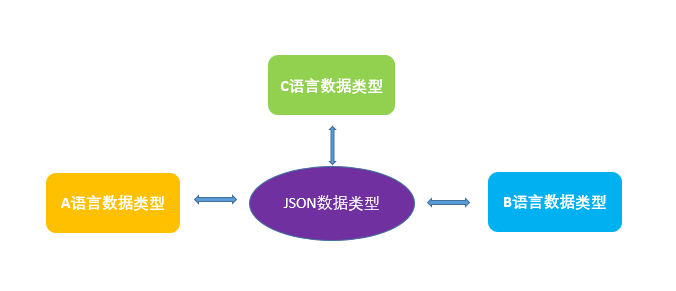

# JSON
全称：JavaScript Object Notation（JavaScript 对象标记）
是一种轻量级的数据交换格式；
字符串是JSON的表现形式；
符合JSON格式的字符串叫做JSON字符串；
相比XML，JSON优势：
易于阅读；易于解析；网络传输效率高；
共有特点：跨语言交换数据

### 反序列化
JSON的载体是字符串，在Python中就是个str；
Python下有个模块叫json，模块下有很多方法去操作JSON数据，json.loads方法可以把JSON转换成Python对应的数据结构；
对于json_str数据，示例如下：
```python
import json
json_str = "{name:Thor,home:Asgard}"
superhero1 = json.loads(json_str)
```
运行后输出结果如下：
```shell
PS D:\Python\codefile\J_JSON> python module_1.py
Traceback (most recent call last):
  File "module_1.py", line 3, in <module>
    superhero1 = json.loads(json_str)
  File "C:\Users\QianHuang\AppData\Local\Programs\Python\Python38\lib\json\__init__.py", line 357, in loads
    return _default_decoder.decode(s)
  File "C:\Users\QianHuang\AppData\Local\Programs\Python\Python38\lib\json\decoder.py", line 337, in decode
    obj, end = self.scan_once(s, idx)
json.decoder.JSONDecodeError: Expecting property name enclosed in double quotes: line 1 column 2 (char 1)
```
可以看到报错了，说明json_str格式不对，在JSON，字符需要用双引号表示，必须是双引号，用单引号也不行，因为JSON是跨语言的，方便其他语言去解析，所以规定了用双引号。里面用双引号后，外部用单引号，修改后如下：
```python
import json
json_str = '{"name":"Thor","home":"Asgard"}'
superhero1 = json.loads(json_str)
print(type(superhero1))
print(superhero1)
print(superhero1['home'])
```
运行后输出结果如下，可以看到输出的是一个dict，并且格式也采用Python默认的单引号：
```shell
PS D:\Python\codefile\J_JSON> python module_1.py
<class 'dict'>
{'name': 'Thor', 'home': 'Asgard'}
Asgard
```
对于同一个JSON字符串，不同的语言可能解析出来的数据类型是不一样的。

上面示例中提到的字符串对应到JSON里面来说表示是JSON的一个object，JSON还有array数组这种数据类型，示例如下：
```python
import json
json_str = '[{"name":"Thor","home":"Asgard"},{"name":"Hulk","home":"Earth"}]'
superhero = json.loads(json_str)
print(type(superhero))
print(superhero)
```
运行后输出结果如下，可以看到输出是一个列表：
```shell
PS D:\Python\codefile\J_JSON> python module_1.py
<class 'list'>
[{'name': 'Thor', 'home': 'Asgard'}, {'name': 'Hulk', 'home': 'Earth'}]
```
稍微修改下，加个元素，是个bool值，并且全小写：
```python
import json
json_str = '[{"name":"Thor","home":"Asgard","hero":true},{"name":"Hulk","home":"Earth"}]'
superhero = json.loads(json_str)
print(type(superhero))
print(superhero)
```
运行后输出结果如下，可以看到输出是一个列表，并且把bool值转换成Python中的格式：
```shell
PS D:\Python\codefile\J_JSON> python module_1.py
<class 'list'>
[{'name': 'Thor', 'home': 'Asgard', 'hero': True}, {'name': 'Hulk', 'home': 'Earth'}]
```
在编程中，有一个术语来定义由字符串到某一种语言对象的解析过程，即反序列化。
下面做了一个表格来表示转换后的数据类型：
语言|字典|列表|字符|整型|浮点数|布尔值
---|:---:|:---|:---|:---|:---|:---
JSON|object|array|string|number|number|true
Python|dict|list|str|int|float|True
### 序列化
就是把Python的数据类型像JSON数据类型转换的过程。
定义一个字典superhero，但是使用了多行，现在转换成JSON数据类型，一样是引用json模块，使用模块下的json.dumps方法来实现：
```python
import json
superhero = [
    {'name': 'Thor', 'home': 'Asgard', 'hero': True},
    {'name': 'Hulk', 'home': 'Earth'}
]
json_str = json.dumps(superhero)
print(type(json_str))
print(json_str)
```
运行后输出结果如下，可以看到bool值和字符类型转换成JSON的格式：
```shell
PS D:\Python\codefile\J_JSON> python module_1.py
<class 'str'>
[{"name": "Thor", "home": "Asgard", "hero": true}, {"name": "Hulk", "home": "Earth"}]    
```
### JSON总结
JSON数据类型是一种中间数据类型，用于多语言间的数据转换；
JSON有自己的数据类型，虽然它和Javascript的数据类型有些类似。
豆瓣API:[https://douban-api-docs.zce.me/](https://douban-api-docs.zce.me/)

用一个图形来概括JSON的用途：

