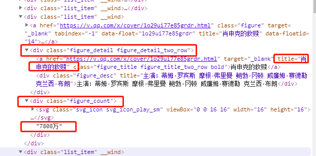
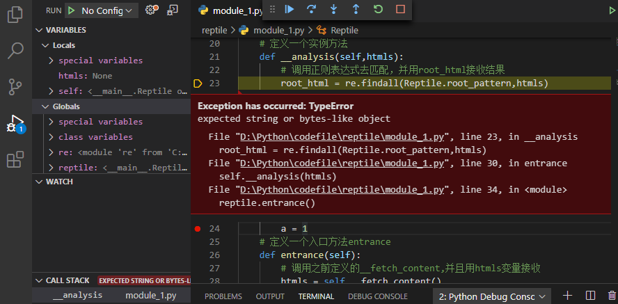
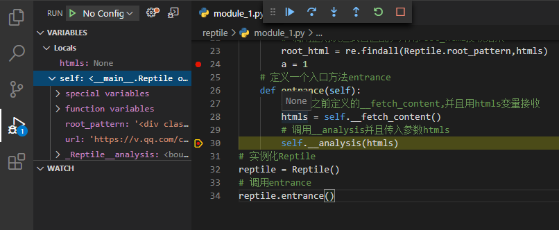
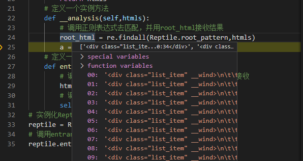

# Python学习笔记-爬虫学习
### 爬虫思路要点
爬虫思路：
- 爬虫的前奏
- 明确目的
- 找到数据对应的网页
- 分析网页的结构并找到数据所在的标签位置

模拟HTTP请求，向服务器发送这个请求，获取到服务器返回的HTML；
用正则表达式提取需要的数据（电影名称，电影点播量）

模拟http请求抓取数据，Python有个内置的库：urllib ，里面有request，request下有个方法urlopen。
下面尝试抓取腾讯视频电影网中高分电影的人气并且进行排行。

爬虫分析要点
- 要寻找到一个标签，或者一个标识符，可以定位到抓取的信息，需要有一个标签定位抓取到的信息
- 一些常量的字符串可以起到定位的边界效果，在提炼htmls时候需要找到一个常量标签能够帮组从一大段htmls中把要提取的信息定位出来

选取标签原则：
- 尽量选取具有唯一标识性的标签作为定位标签，如果不唯一，很容易匹配到一些无用的信息
- 尽量寻找接近寻找的数据的标签

### 爬虫实战
抓取腾讯视频电影某一页中的电影名，播放量和评分

#### 标签截取
寻找定位标签，电影名肖申克的救赎最近的标签可以选择\<div class="figure_detail figure_detail_two_row">，人气7808万比较近的可以选择div class=”figure_count"，这两个标签是不是唯一的建议用代码去验证。
如果直接对找到的两个标签分别去做正则表达式分析，可以得到一组电影名和一组人气数值，但是两组数据如何对应起来就不方便了，所以建议把这个数据看作结合在一起的一组数据，在这组数据外面找一个标签，可以看到离这组数据最近标签可以选择\<div class="list_item" __wind>，通过这个标签可以缩小匹配的范围，可拿到里面的内容，然后再用正则表达式去匹配里面的名字和人气值：

\<div class="list_item" __wind>([\s\S]\*?)\</div>表达式中 ([\s\S]\*?)用括号括起来是组的概念，表示只截取中间内容

尽量选取可以闭合的标签，例如上面示例中的\<div class="list_item" __wind>，内部包含需要抓取的所有信息,闭合后是\<div class="list_item" __wind>，\</div>是结束标记
#### 代码调试
可以采用断点调试方式，代码行序号左边的红点就是标记的断点，运行后报错会指出，鼠标移动到对应的位置可以查看报错信息：

对于对象，也可以用鼠标光标指向进行查看，左边也有选项可以查看所有的对象，可以看到下面的是None，说明代码有问题：


下面就是查看获取的值，断点调试的时候可以验证是否是需要获取的数据，确认无误然后就可以继续下一步了：


#### 完整代码
编写完整代码如下：
```python
# 导入正则表达式模块
import re
# 从urllib中导入request
from urllib import request
# 定义一个类Reptile
class Reptile():
    # 定义一个类变量url保存抓取网页的地址
    url = 'https://v.qq.com/channel/movie?channel=movie&itype=100062&listpage=1&sort=21'
    # 先把正则表达式字符串在类变量里面赋值给一个变量
    root_pattern = '<div class="list_item" __wind>([\s\S]*?</div>[\s\S]*?</div>[\s\S]*?</div>[\s\S]*?</div>[\s\S]*?)</div>'
    # 匹配名字的正则表达式
    name_pattern = ' class="figure_title figure_title_two_row bold">([\s\S]*?)</a>'
    # 匹配评分的正则表达式
    score_pattern = '<div class="figure_score">([\s\S]*?)</div>'
    # 匹配观看人数的正则表达式,$是从字符串尾开始匹配，刚好结尾字符就是需要的值，匹配到</svg>就结束
    views_pattern = '</svg>([\s\S]*)$'
    # 定义一个私有方法获取网页内容
    def __fetch_content(self):
        # 使用request下的方法urlopen，并且读取类变量，用一个变量保存返回结果
        r = request.urlopen(Reptile.url)
        # read这个方法可以把结果读取出来
        htmls = r.read()
        # htmls结果会是字节码，转换成字符串，并且指定编码方式
        htmls = str(htmls,encoding='utf-8')
        # 返回htmls,后面entrance中的htmls就有值了
        return htmls
    # 定义一个实例方法
    def __analysis(self,htmls):
        # 调用正则表达式去匹配，并用root_html接收结果
        root_html = re.findall(Reptile.root_pattern,htmls)
        # 定义一个list去接收最终结果
        films = []
        # 用循环遍历root_html去匹配
        for html in root_html:
            # 匹配名字
            name = re.findall(Reptile.name_pattern,html)
            # 匹配评分
            score = re.findall(Reptile.score_pattern,html)
            # 匹配浏览量
            views = re.findall(Reptile.views_pattern,html)
            # 用字典接收三个值
            film = {'name':name,'score':score,'views':views}
            # 在列表中添加元素中append方法
            films.append(film)
        # 调试时候可以打印root_html的0号元素进行查看内容
        # print(root_html[0])
        # 打印输出结果可以查看调试
        # print(films)
        return(films)
    # 定义一个方法提炼优化输出结果
    def __refine(self,films):
        # 使用lambda表达式来进行优化，用一个普通函数也可以
        # strip()可以去掉前后的换行符和空格，此实例赘余的东西比较少，就score后面有个空格
        refine = lambda film:{'name':film['name'][0],
        'score':film['score'][0].strip(),
        'views':film['views'][0]}
        # 返回结果，调用map会把films每个元素都传到refine里面去执行
        return map(refine,films)
    # 定义一个方法指定排序规则
    def __sort_rule(self,film):
        # 用正则表达式匹配出观看人数里面的数字（此时还是字符）
        num = re.findall('\d*',film['views'])
        # 将字符转换成数字去排序
        number = float(num[0])
        # 可以看到数字里面有万这个单位，加入一个条件语句
        if '万' in film['views']:
            # 将数字乘以万
            number *= 10000
        # 返回得到的的值
        return number
    # 定义一个方法进行排序
    def __sort(self,films):
        # Python内置了一个函数sorted可以进行排序,可以传入一个函数
        # 必须加入key参数，作为排序的依据，可以传入一个函数指定排序规则ru
        # 默认是升序，reverse参数可以颠倒排序方式
        films = sorted(films,key=self.__sort_rule,reverse=True)
        # 返回得到的结果
        return films
    # 定义一个方法展示出结果
    def __show(self,films):
        # 用for循环依次打印出来
        for film in films:
            print('电影名：'+ '《' + film['name']+'》'+' 评分:'+film['score']+'分'+' 观看人数：'+film['views'])
    # 定义一个入口方法entrance
    def entrance(self):
        # 调用之前定义的__fetch_content,并且用htmls变量接收
        htmls = self.__fetch_content()
        # 调用__analysis并且传入参数htmls,并用films接收结果
        films = self.__analysis(htmls)
        # 调用__refine并且把films传入,重新赋值给films，结果是个对象，需要转换成list
        films = list(self.__refine(films))
        # 调用__sort并把films传入
        films = self.__sort(films)
        # 调用__show并把films传入
        self.__show(films)
        # 调式时候可以打印films查看
        # print(films)
# 实例化Reptile
reptile = Reptile()
# 调用entrance
reptile.entrance()
```
最终，输出结果得到理想的结果：
```shell
PS D:\Python\codefile\reptile> python module_1.py
电影名：《泰坦尼克号》 评分:9.5分 观看人数：9237万
电影名：《盗梦空间》 评分:9.5分 观看人数：9034万
电影名：《肖申克的救赎》 评分:9.7分 观看人数：7818万
电影名：《霸王别姬》 评分:9.6分 观看人数：6788万
电影名：《忠犬八公的故事》 评分:9.4分 观看人数：6276万
电影名：《阿甘正传》 评分:9.5分 观看人数：5605万
电影名：《机器人总动员》 评分:9.4分 观看人数：4428万
电影名：《海豚湾》 评分:9.3分 观看人数：3189万
电影名：《教父1》 评分:9.4分 观看人数：2650万
电影名：《辛德勒的名单》 评分:9.5分 观看人数：2166万
电影名：《灿烂人生》 评分:9.4分 观看人数：1977万
电影名：《大闹天宫》 评分:9.4分 观看人数：1970万
电影名：《放牛班的春天》 评分:9.4分 观看人数：1755万
电影名：《乱世佳人》 评分:9.3分 观看人数：1578万
电影名：《海上钢琴师》 评分:9.4分 观看人数：1454万
电影名：《七武士》 评分:9.2分 观看人数：1395万
电影名：《我们的父辈》 评分:9.6分 观看人数：1239万
电影名：《背靠背，脸对脸》 评分:9.4分 观看人数：882万
电影名：《摩登时代》 评分:9.3分 观看人数：872万
电影名：《永远的车神》 评分:9.2分 观看人数：781万
电影名：《茶馆》 评分:9.4分 观看人数：591万
电影名：《生活多美好》 评分:9.3分 观看人数：447万
电影名：《城市之光》 评分:9.3分 观看人数：379万
电影名：《切腹》 评分:9.2分 观看人数：245万
电影名：《贵妃醉酒》 评分:9.2分 观看人数：119万
电影名：《群英会京剧》 评分:9.1分 观看人数：107万
电影名：《丝路花雨》 评分:9.2分 观看人数：95万
电影名：《你逃我也逃》 评分:9.1分 观看人数：51万
电影名：《借东风》 评分:9.2分 观看人数：31万
电影名：《梅兰芳的舞台艺术 (下)》 评分:9.1分 观看人数：13万
```
### 总结
整体思路就是入口方法里面的步骤：
- 获取网页数据
- 用正则表达式分析数据，得到想要的数据
- 优化数据
- 对数据进行排序
- 展示数据

### 其它推荐
beautifulSoup这个库可以有更简单的方法提炼内容，不用太依赖正则表达式：
[https://www.crummy.com/software/BeautifulSoup/](https://www.crummy.com/software/BeautifulSoup/)

Scrapy爬虫框架，做一些多线程的爬虫，可以考虑使用:
[https://scrapy.org/](https://scrapy.org/)

运行爬虫IP可能会被封，爬的频率最好不要太高.
