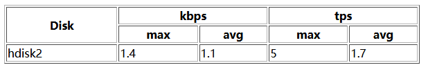

# HTML-基础学习笔记
学习HTML记得基础笔记。
## 基础知识
### 标签和元素
&#8195;&#8195;元素里面有：属性、内容、嵌套标签和自封闭标签。有些标签不是成对出现，例如换行标签：&#60;br&#62;。例如下面示例中&#60;title&#62;就是标签，下面整个内容叫做元素：
```html
<title>"Interstellar"</title>
```
#### 元素
分类：
- 块级元素
- 行内元素

### 基本框架
```html
<!DOCTYPE html>
<html lang="en"> 
    <head>
        <meta charset="UTF-8">
        <title>"Interstellar"</title>
    </head>
    <body>

    </body>
</html>
```
说明:
- &#60;!DOCTYPE html&#62;：文档声明标签，此为html5的
- `lang="en"`:网页使用文字的语言，属性的值用双引号或者单引号
- &#60;head&#62;:不呈现在正文部分，`<title>`是网页标题
- &#60;body&#62;:正文部分，就是网页页面呈现的内容
- &#60;meta charset="UTF-8"&#62;:声明网页编码模式

## 表格
### 表格样式
可以使用CSS控制网页样式和布局，代码不多可以直接写在html中：
```html
<style tpye="info/css">
.infotable{
    width:400px;
    height:100px;
    margin:0 auto
    }
</style>
    <table class="infotable" border="1">
        ...
    </table>
```
也可以在创建表格时候直接添加属性：
```html
<table border="1" width="650">
    <tr>
        <td align="center">Item</td>
        <td align="center">Value</td>
        <td align="center">Remarks</td>
    </tr>
</table>
```
### 常用标签
表格中常用标签：
- &#60;table&#62;:标签定义HTML表格,链接：[HTML <table> 标签](https://www.w3school.com.cn/tags/tag_table.asp)
- &#60;tr&#62;：标签定义HTML表格中的行，链接：[HTML <tr> 标签](https://www.w3school.com.cn/tags/tag_tr.asp)
- &#60;th&#62;:定义表格内的表头单元格,链接：[HTML <th> 标签](https://www.w3school.com.cn/tags/tag_th.asp)
- &#60;td&#62;:标签定义HTML表格中的标准单元格，链接：[HTML <td> 标签](https://www.w3school.com.cn/tags/tag_td.asp)

### 单元格的合并
通过HTML&#60;td&#62;标签的colspan和rowspan属性实现:
```html
<html>
<body>
<table width="600" border="1">
  <tr>
    <th rowspan="2">Disk</th>
    <th colspan="2">kbps</th>
	<th colspan="2">tps</th>
  </tr>
    <tr>
    <th>max</th>
	<th>avg</th>
	 <th>max</th>
	<th>avg</th>
  </tr>
  <tr>
    <td>hdisk2</td>
    <td>1.4</td>
	<td>1.1</td>
	<td>5</td>
	<td>1.7</td>
  </tr>
</table>
</body>
</html>
```
运行后样式如下图：   


colspan参考学习链接：[https://www.w3school.com.cn/tags/att_td_colspan.asp](https://www.w3school.com.cn/tags/att_td_colspan.asp)     
rowspan参考学习链接：[https://www.w3school.com.cn/tags/att_td_rowspan.asp](https://www.w3school.com.cn/tags/att_td_rowspan.asp)

## 标题
