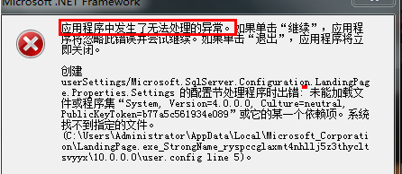

# Windows-SQLR2完全卸载&安装
文章是较早时候写的，放在百度文库上，阅读量两万多，下载量过一千（下载赚的积分够用好几年），说明需求还是有不少的，文章有点实际意义，所以搬到这里来，以后新版的Microsoft SQL server的问题说不定可以参考下。

本blog追求精简，和之前文章一样不喜欢贴图，图文的文档可以参考百度文库链接：[Microsoft SQL server 2008 R2完全卸载再安装手册](https://wenku.baidu.com/view/8f4eaf58cfc789eb172dc8c5)

Microsoft SQL Server 2008 R2安装后，可能一些原因导致程序故障，需要重新安装，但是卸载后，很难再进行安装，基本都会报错，导致程序无法正常安装使用，以下是亲测记录过程，屡试不爽，以及一些其它可能出现的问题，如参照以下方法仍旧不能解决，建议重新安装系统，再安装数据库，这是最简单最有效的方法。
### 完全卸载Microsoft SQL server 2008 R2
##### 卸载应用程序
步骤如下：
- 进入控制面板-->选择程序和功能
- 找到Microsoft SQL Server 2008 R2，点击右键，选择卸载/更改
- 弹出对话框中选择“删除”选项
- 弹出对话框会进行检测，通过才能继续，一般“重启计算机”选项会不过，重启下计算机通过后继续
- 弹出对话框选择要删除的实例，然后点击下一步
- 选择要删除的功能，全选，然后下一步
- 弹出对话框会进行检测，全部通过即没问题，选择下一步
- 点击删除开始删除
- 等待删除完成
- 然后进入控制面板-->选择程序和功能，右键删除里面所有有关Microsoft SQL server的项目:
    - Microsoft SQL server 2008 R2 Native Client
    - Microsoft SQL server 2008 R2 安装程序（简体中文）
    - Microsoft SQL server 2008 R2 策略
    - Microsoft SQL server 2008 R2 联机丛书
    - Microsoft SQL server 2008 安装程序支持文件
    - Microsoft SQL server Browser
    - Microsoft SQL server Compact 3.5 SP2 CHS
    - Microsoft SQL server Compact 3.5 SP2 Query Tools CHS
    - Microsoft SQL server System CLR Types(x64)
    - Microsoft SQL server VSS Writer

##### 使用工具卸载
有些机器的数据库可能因为某些原因，导致不能如上正常卸载，可以运用Windows Install Clean Up 进行删除程序
一般系统自带，如没有，下载地址：http://pan.baidu.com/s/1qWG37T6

下载安装后运行程序，找到关于Microsoft SQL Server 的选项，全部选择，然后点击Remove，需要时间，请耐心等待，完成后根据上面的介绍，删除文件夹和注册表的残余项目。
##### 文件删除
删除安装盘中残余文件，本次安装默认在C盘，路径如下所示，
- C:\Program Files\Microsoft SQL Server
- C:\Program Files (x86)\Microsoft SQL Server（64位操作系统有此项）
- C:\Program Files (x86)\Microsoft SQL Server Compact Edition（64位操作系统）
- C:\Users\Administrator\AppData\Local\Microsoft
- C:\Users\Administrator\AppData\Roaming\Microsoft

说明：
- Users 即windows 7 的C盘下“用户”文件夹，windows 8显示为Users，Administrator即计算机管理员账户，具体根据电脑自定义的名称
- 如果找不到administrator文件夹下面的AppData文件夹，说明被隐藏了，显示隐藏文件即可
- 如果再删除文件夹的时候，发现删除不掉，提示被占用，可以选择重启计算机试试，如果还是不行，可以用强制的方法，可以采取一些软件自带的粉碎文件的操作

##### 注册表信息删除
删除注册表残余项目，运行`regedit`注册表，删除如下项（如果有的话，有些项目跟个人电脑安装软件有关联），路径具体操作如下：
- HKEY_CURRENT_USER\Software\Microsoft\Microsoft SQL Server
- HKEY_LOCAL_MACHINE\SOFTWARE\Microsoft\Microsoft SQL Server 
- HKEY_LOCAL_MACHINE\SOFTWARE\Microsoft\MSSQLServer
- HKEY_LOCAL_MACHINE\SYSTEM\CurrentControlSet\Contorl\Session Manager\PendingfileRename*

到此就删除完成了，亲测有效，下面安装过程就是在此处卸载完成后进行的。

### 再次安装Microsoft SQL server 2008 R2
##### 介质下载 
下载Microsoft SQL Server 2008 R2，打开安装文件夹，运行setup.exe    
Microsoft SQL Server 2008 R2下载地址：http://pan.baidu.com/s/1nthxNxn

此文件为.iso格式，下载后解压即可，或者用虚拟光驱，下载安装虚拟光驱后，右键点击文件，选择加载    
虚拟光驱下载地址：http://pan.baidu.com/s/1mg5Mt5I
##### 安装
如果运行安装程序中发现如下错误，请参照下面描述进行处理，如没有，跳过此步:

打开C:\Users\Administrator\AppData\Local, 打开Local后，找到Microsoft_Corporation文件夹下的LandingPage.exe_StrongName_ryspccglaxmt4nhllj5z3thycltsvyyx这个文件夹，删除此文件夹即可正常运行安装程序。
继续下面步骤：
- 弹出安装程序界面，选择安装，全新安装或向现有安装添加功能
- 进行检测，全部通过即可，卸载干净情况下一般都是通过的，如有失败的，请再参照上面进行删除
- 输入产品秘钥，然后下一步
- 接受许可条款，然后下一步
- 安装支持文件

如果SQL Server 2008 R2在此处安装过程中提示Could not open key请参照如下解决方案，如没有报错，请跳过此步，
此问题为权限设置有问题，导致程序无法访问，修改权限即可。首先找到提示的位置，报错信息中写的UNKNOWN，地址未知，根据后面的路径，可以找到具体位置。
解决方法一：
以管理员身份运行CMD命令提示符，输入以下语句并运行就OK了
secedit /configure /cfg %windir%\inf\defltbase.inf /db defltbase.sdb /verbose

如方法一无法解决，请参照解决方法二：
- 注册表位置：
HKEY_LOCAL_MACHINE\SOFTWARE\Microsoft\ Windows\CurrentVersion\ Installer\ UserData\ S-1-5-18\ Components
- 选中Components右键，选择权限，然后选择everyone，点击添加
- 选择用户或组界面点击高级
- 然后点击立即查找，找到everyone，点击确定
- 可以看到用户或租里面有everyone了，点击确定
- 在Components的权限对话框中选择everyone，勾上完全控制和读写权限，然后点击高级选项
- 点击所有者，选择其它用户或组，然后点击高级，添加上everyone
- 选择好Everyone后，点击确定，在高级设置里面勾上：替换子容器和对象所有者

在刚刚错误界面点击确定就可以了，安装程序会继续，如果继续报错，继续刚才步骤，没报错会进行下面操作：
- 安装程序支持规则，全通过了就下一步
- 设置角色（根据需求）
- 选择功能，全选或根据需求，目录可以根据自己意愿更改，点击下一步
- 安装规则，全部通过，跳过就没问题
- 实例配置，默认实例或根据需求
- 磁盘空间需求
- 服务器配置，根据需求配置
- 数据库引擎配置，选择混合模式（或根据需求），指定SQL Server 管理员添加当前用户
- Analysis Services 配置，添加当前用户，然后下一步
- Reporting Services 配置，按照本机模式默认配置（或根据需求）
- 错误报告页面，点击下一步
- 安装配置规则，通过跳过就没问题
- 开始安装，理论上，前面删除干净了，检测都通过，没有报错，就静静的等待安装程序进行即可。但是有时候也会在此处报错，目前在此处只遇到过一个因为系统windows installer服务未开启导致的安装报错。
