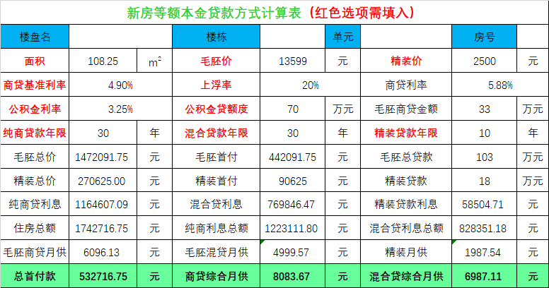
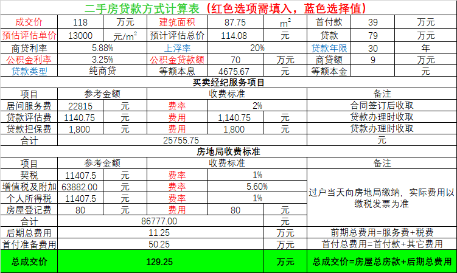
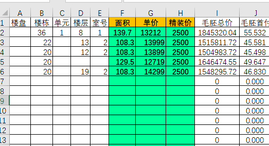

# Windows-Excel购房贷款计算器
分享一个小工具，Excel做的一个购房贷款计算器，很简单，但是很实用，目前只做了等额本息的模式，分享下。

看房子时候，置业顾问和中介在那里用手机和笔算感觉效率比较低，还经常算错，对于新房同户型不通楼层价格也不一样，所以结果也会不一样，一般他们也就只会算一个供参考，其实有些楼层价格差距还是很大的；对于二手房，不同二手房也经常需要对比下，所以自己搞了个Excel去计算，方便快捷，并且可以进行全方位对比。

Excel中一共有三个表格：新房贷款计算表、二手房贷款计算表和列表简略版   
链接：https://pan.baidu.com/s/18o1hj_QaEwHPE48vx6Ls1w      
提取码：e836 

### 新房贷款计算表
表格中红色的选项根据实际情况填入或选择对应选项即可，后面几行的内容都会自动算出来。   
图表示例：   

### 二手房贷款计算表
表格中红色选项需填入，选项有点多，因为个地方政策或中介的收费不一样，蓝色选择值即可。   
图表示例：   

### 列表简略版
这款就比较简洁，一列就是一套房的贷款明细，填入面积、毛胚单价和精装价格即可，列表形式显示，适合对比整栋楼和多套，适合售楼部卖房的直接统计多栋楼的价格。     
图表示例：    

