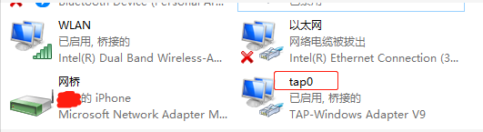

# QEMU-虚拟AIX系统
AIX系统运行在IBM Power小型机上，由于底层架构上的区别，很少有平台可以去虚拟。QEMU很强大，可以模拟Power环境虚拟AIX系统，当然也有限制，不过用来学习AIX系统还是很方便的，有兴趣的可以联系我进行学习交流。
### 各平台简介
之前跟着大佬学习了Linux下用QEMU虚拟AIX，Linux下安装步骤：安装VMware、安装Linux、安装QEMU、最后虚拟AIX。安装特麻烦，个人电脑一般是Windows系统，对机器性能和使用上都很不方便。

后来尝试在Windows下用QEMU虚拟AIX，感觉学习起来很方便。但是AIX安装也是比较麻烦，很耗时间（顺利的话也要好几个小时），各种问题。所以这里分享一个直接用已安装配置好的虚拟磁盘拉起来的方法，好比VMware的`.ova`文件，直接恢复虚拟机。

### 准备文件
搭建系统和QEMU版本应该区别不大，我使用版本如下：
- 机器及系统版本：ThinkPad X250 Windows 10
- QUME版本：QEMU 4.1.0
- tap-windows版本：9.21.1
- HAXM版本：haxm-windows_v7_5_4
- AIX系统版本：AIX7.2.3.1

安装包：
- qemu-w64-setup-20200201.exe:官网下载
- tap-windows-9.21.1.exe：网上找
- haxm-windows_v7_5_4.zip：网上找
- AIX72.img：已安装配置好的QEMU虚拟机磁盘镜像

### 安装配置
##### 安装软件
步骤如下
- 安装HAXM，全称Hardware Accelerated Execution Manager，intel的硬件加速执行管理器。
- 安装QUEMU
- 安装tap-windows：用来搭建网桥让AIX访问外网
- 将AIX72.img放置到QEMU安装文件夹的根目录下

##### 启动AIX
管理员运行Windows的CMD，cd到QEMU的安装目录，运行如下命令启动AIX:
```shell
qemu-system-ppc64.exe -cpu POWER7 -machine pseries -m 2048 -serial mon:stdio -drive file=AIX72.img,if=none,id=drive-virtio-disk0 -device virtio-scsi-pci,id=scsi0 -device scsi-hd,drive=drive-virtio-disk0 --net nic -net tap,ifname=tap0
```
没几分钟就启动了，很快：
```shell
AIX Version 7
Copyright IBM Corporation, 1982, 2018.
Console login:
The '/usr/lpp/diagnostics/bin/diagd' command is not supported on this system.
```
diag命令主要是硬件诊断，所以虚拟AIX不支持这个命令。

##### 网络配置
在cmd下敲命令很不方便，smit命令完全乱码，并且没外网学习也很不方便，所以用tap-windows搭一个网桥。TAP网卡名字和注意和ifname一致，示例如下：


AIX系统配置IP此处不作详述。

### 系统演示
网络配通后可以用xshell等终端软件进入，操作演示如下：
```
# lspv
hdisk0          00000000f9d61667                    rootvg          active      
hdisk1          none                                None          
# lscfg -vpl hdisk0
  hdisk0           qemu_virtio-scsi-pci:0000:00:02.0-LW_0  MPIO Other Virtio SCSI Disk Dri
ve
        Manufacturer................QEMU    
        Machine Type and Model......QEMU HARDDISK   
# prtconf   
System Model: IBM pSeries (emulated by qemu)
Machine Serial Number: Not Available
Processor Type: PowerPC_POWER7
Processor Implementation Mode: POWER 7
Processor Version: PV_7_Compat
Number Of Processors: 1
Processor Clock Speed: 1000 MHz
CPU Type: 64-bit
Kernel Type: 64-bit
LPAR Info: 0 aix_on_kvm
Memory Size: 2048 MB
Good Memory Size: 2048 MB
Platform Firmware level: Not Available
```
可以看到处理器只有1000MHz，所以用来学习操作系统就行了，想跑啥应用测试还是算了。

连接了外网，就可以配置YUM，安装Python，学习还是很方便的。

IBM 官方一些AIX 软件下载地址：[AIX Toolbox for Linux Applications](https://www.ibm.com/support/pages/node/883796?mhsrc=ibmsearch_a&mhq=AIX%20Toolbox%20for%20Linux%C2%AE%20Applications)
