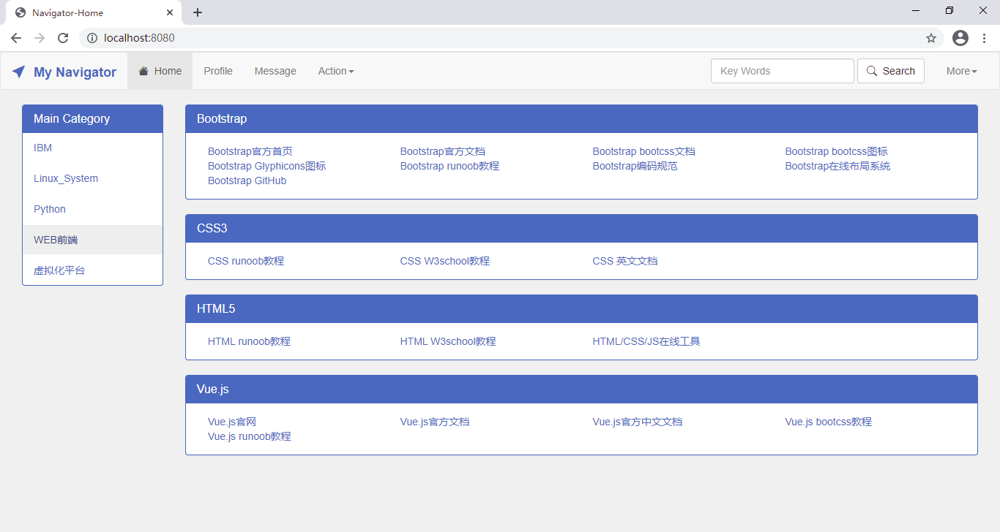
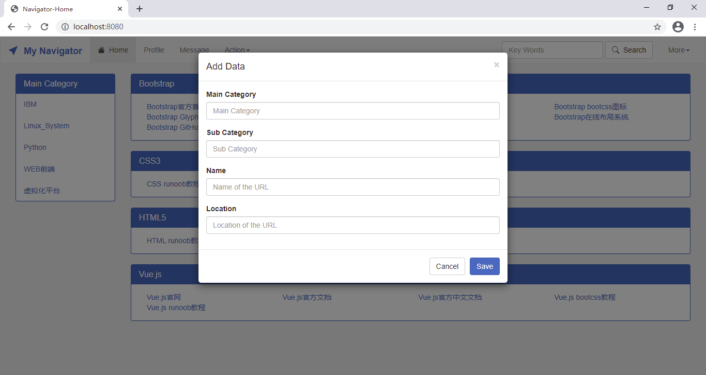
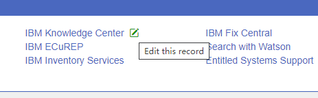
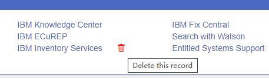

# Navigator-基础环境
基础环境搭建简介。
## 效果预览
选择一个主项目：      


添加：   


编辑：   


删除：   


## 基础环境准备
使用的windows系统，需要环境及使用版本：
- Python：Python 3.8.3
- Flask：Flask 1.1.2
- Jinja2：2.11.2
- sqlite3

### GitHub创建项目
创建了名为navigator的Repository，添加了`.gitignore`、`LICENSE`及`README`文件。
### 克隆到本地
克隆到本地：
```sh
$ git clone git@github.com:bond-huang/navigator.git
Cloning into 'navigator'...
remote: Enumerating objects: 8, done.
remote: Counting objects: 100% (8/8), done.
remote: Compressing objects: 100% (6/6), done.
remote: Total 8 (delta 1), reused 0 (delta 0), pack-reused 0
Receiving objects: 100% (8/8), 6.12 KiB | 783.00 KiB/s, done.
Resolving deltas: 100% (1/1), done.
```
### 创建虚拟环境
git bash命令如下：
```sh
$ python -m venv venv
$ ls
LICENSE  README.md  venv/
```
打开cmd激活环境：
```
D:\navigator>venv\Scripts\activate
(venv) D:\navigator\venv\Scripts>
```
## 项目布局
布局如下：
```
-- navigator
    |-- instance
    |   `-- nav.sqlite
    |-- LICENSE
    |-- MANIFEST.in
    |-- nav
    |   |-- db.py
    |   |-- __init__.py
    |   |-- navigation.py
    |   |-- schema.sql
    |   |-- static
    |   |   |-- nav.js
    |   |   `-- style.css
    |   `-- templates
    |       |-- base.html
    |       |-- footer.html
    |       |-- header.html
    |       |-- index.html
    |       `-- modal
    |           |-- add.html
    |           |-- edit.html
    |           |-- empty.html
    |           `-- license.html
    |-- README.md
    |-- setup.cfg
    |-- setup.py
    `-- tests
        |-- conftest.py
        |-- data.sql
        |-- test_db.py
        |-- test_factory.py
        `-- test_navigator.py
```
### 创建应用
创建目录`nav`并添加`__init__.py`文件，写入内容：
```py
import os
from flask import Flask
def create_app(test_config=None):
    # create and configure the app
    app = Flask(__name__,instance_relative_config=True)
    app.config.from_mapping(
        SECRET_KEY='dev',
        DATABASE=os.path.join(app.instance_path,'nav.sqlite'),
    )
    if test_config is None:
        # load the instance config, if it exists, when not testing
        app.config.from_pyfile('config.py',silent=True)
    else:
        # load the test config if passed in
        app.config.from_mapping(test_config)
    # ensure the instance folder exists
    try:
        os.makedirs(app.instance_path)
    except OSError:
        pass
    # a simple page that says gump
    @app.route('/home')
    def home():
        return 'Life was like a box of chocolates, \
        you never know what you\'re gonna get.'
    return app
```
### 环境测试
测试环境是否可用：
```sh
$ export FLASK_APP=nav
$ export FLASK_ENV=development
$ flask run
 * Serving Flask app "nav" (lazy loading)
 * Environment: development
 * Debug mode: on
 * Restarting with stat
 * Debugger is active!
 * Debugger PIN: 142-805-651
 * Running on http://127.0.0.1:5000/ (Press CTRL+C to quit)
```
打开浏览器，输入地址`http://127.0.0.1:5000/home`看到`__init__.py`中home函数里面return内容表示正常。
## 定义数据库
### 连接数据库
在nav目录下创建db.py文件，写入内容：
```py
import sqlite3
import click
from flask import current_app, g
from flask.cli import with_appcontext
def get_db():
    if 'db' not in g:
        g.db =  sqlite3.connect(
            current_app.config['DATABASE'],
            detect_types=sqlite3.PARSE_DECLTYPES
        )
        g.db.row_factory = sqlite3.Row
    return g.db
def close_db(e=None):
    db = g.pop('db',None)
    if db is not None:
        db.close()
def init_db():
    db = get_db()
    with current_app.open_resource('schema.sql') as f:
        db.executescript(f.read().decode('utf8'))
@click.command('init-db')
@with_appcontext
def init_db_command():
    # Clear the existing data and create new tables.
    init_db()
    click.echo('Initialized the database')
def init_app(app):
    app.teardown_appcontext(close_db)
    app.cli.add_command(init_db_command)
```
### 创建表
在nav目录下创建schema.sql文件，写入内容：
```sql
DROP TABLE IF EXISTS links;

CREATE TABLE links (
  id INTEGER PRIMARY KEY AUTOINCREMENT,
  maincategory  TEXT NOT NULL,
  subcategory TEXT NOT NULL,
  urlname TEXT UNIQUE NOT NULL,
  urllocation TEXT NOT NULL
);
```
### 在应用中注册
写一个函数，把应用作为参数，在函数中进行注册（`db.py`文件中）：
```python
def init_app(app):
    app.teardown_appcontext(close_db)
    app.cli.add_command(init_db_command)
```
在`__init__.py`中导入并调用这个函数:
```python
...
    from . import db
    db.init_app(app)
    return app
```
### 初始化数据库文件
停止之前的虚拟环境，然后激活环境：
```
(venv) D:\navigator\venv\Scripts>deactivate
D:\navigator\venv\Scripts>activate
(venv) D:\navigator\venv\Scripts>
```
设置`FLASK_APP`和`FLASK_ENV`并运行`init-db`命令：
```
$ export FLASK_APP=nav
$ export FLASK_ENV=development
$ flask init-db
Initialized the database
```
## Blueprints和视图
### 创建Blueprints
&#8195;&#8195;导航网站不需要认证，做个页面管理Blueprints即可。定义blueprints并注册到应用工厂，在nav目录下创建文件navigation.py并写入如下内容：
```python
from flask import(
    Blueprint,flash,g,redirect,render_template,request,url_for
)
from werkzeug.exceptions import abort
from nav.db import get_db
bp = Blueprint('navigation',__name__)
```
在工厂中导入和注册蓝图，将新代码放在`__init__.py`的尾部，返回应用之前:
```python
    from . import navigation
    app.register_blueprint(main.bp)
    app.add_url_rule('/',endpoint='index')
```
## 静态文件
&#8195;&#8195;存放图片，CSS及JS等，计划使用Bootstrap，Vue和jQuery，直接从网上获取，CSS全部用Bootstrap，JS会写一点东西，新建一个文件即可。在nav目录下新建目录static并创建文件nav.js。

删除和编辑图标使用了自定义样式：
```css
.editicon i {
    color: rgba(255, 255, 255, 0);
}
.editicon i:hover {
    color: green;
}

.deleteicon i {
    color: rgba(255, 255, 255, 0);
}
.deleteicon i:hover {
    color: red;
}
```
编辑模态框使用的js：
```js
// editModal
$('#editModal').on('show.bs.modal', function (event) {
        var button = $(event.relatedTarget) // Button that triggered the modal
        var link_id = button.data('link_id') // Extract information from data-* attributes
        var link_mcg = button.data('link_mcg')
        var link_scg = button.data('link_scg')
        var link_name = button.data('link_name')
        var link_url = button.data('link_url')
        var modal = $(this)
        $("#linkid").attr("action", link_id);
        $("#linkmcg").attr("value", link_mcg);
        $("#linkscg").attr("value", link_scg);
        $("#linkname").attr("value", link_name);
        $("#linkurl").attr("value", link_url);
  })
```
### 索引
索引会显示所有内容，在navigation.py中继续写入一下内容：
```python
@bp.route('/')
def index():
    db = get_db()
    links = db.execute(
        'SELECT * FROM links'
    ).fetchall()
    maincg_list = db.execute(
        'SELECT distinct maincategory FROM links'
    ).fetchall() 
    links_list = []
    links.sort(key=itemgetter('maincategory'))
    for i,j in groupby(links,key=itemgetter('maincategory')):
        j = list(j)
        j.sort(key=itemgetter('subcategory'))
        sub_list = []
        for x,y in groupby(j,key=itemgetter('subcategory')):
            y = list(y)
            subdict = {'sub_cg':x,'link':y}
            sub_list.append(subdict)
        maindict = {'main_cg':i,'sub_cg_list':sub_list}
        links_list.append(maindict)
    return render_template('index.html',links=links_list,maincg_list=maincg_list)
```
说明：
- 示例中红从数据库取出两个内容，第一个是表中所有内容，第二个只是取maincategory值并去重
- 示例中对数据进行了处理，其实就是分类处理，方便jinja2进行渲染
