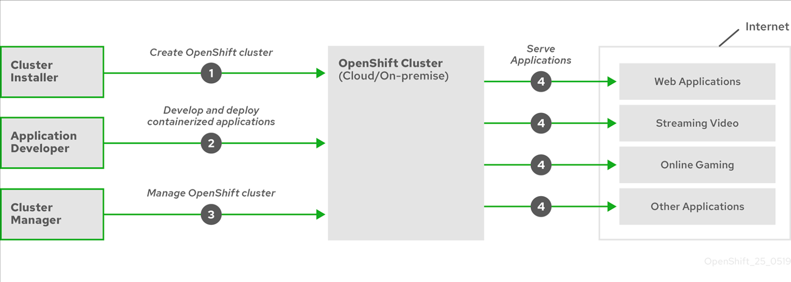

# OpenShift-简介
内容来自学习的IBM在线实验室发布的学习链接：[OpenShift 容器平台简介和离线裸机安装步骤](https://csc.cn.ibm.com/roadmap/index/6cad9db3-bca0-45a8-abbc-c2c6fd38cb60?eventId=5c9e9c67-e55e-483a-a6bb-32f89b1bdc23)
## 简介
### OpenShift容器平台简介
&#8195;&#8195;OpenShift是容器平台以Kubernetes为基础由红帽（Red Hat）开发的容器化软件解决方案，是用于开发和运行容器化应用程序的平台。它旨在允许支持它们的应用程序和数据中心从仅几台机器和应用程序扩展到为数百万个客户提供服务的数千台机器。
### 关于Kubernetes
&#8195;&#8195;Kubernetes是一个开源容器编排引擎，用于自动化容器化应用程序的部署，扩展和管理。Kubernetes的一般概念非常简单：
- 从一个或多个工作程序节点开始运行容器工作负载
- 从一个或多个主节点管理这些工作负载的部署
- 将容器包装在称为吊舱的部署单元中。使用pod可以为容器提供额外的元数据，并可以在单个部署实体中对多个容器进行分组
- 创建特殊种类的资产。例如，服务由一组Pod以及定义访问方式的策略表示。即使容器没有用于服务的特定IP地址，此策略也可以使容器连接到所需的服务。复制控制器是另一项特殊资产，它指示一次需要运行多少个Pod副本。您可以使用此功能来自动扩展应用程序以适应其当前需求。

### 容器化应用程序的优势
&#8195;&#8195;与使用传统部署方法相比，使用容器化应用程序具有许多优势。曾经期望将应用程序安装在包含所有依赖项的操作系统上的地方，容器让应用程序随身携带其依赖项。创建容器化的应用程序有很多好处。

#### 操作系统的好处
&#8195;&#8195;容器使用没有内核的小型专用Linux操作系统。它们的文件系统，网络，cgroup，进程表和名称空间与主机Linux系统是分开的，但是容器可以在必要时与主机无缝集成。基于Linux，容器可以利用快速创新的开源开发模型附带的所有优势。    
&#8195;&#8195;因为每个容器都使用专用的操作系统，所以您可以在同一主机上部署需要冲突软件依赖关系的应用程序。每个容器都带有自己的从属软件，并管理自己的接口，例如网络和文件系统，因此应用程序无需竞争这些资产。
#### 部署和扩展优势
&#8195;&#8195;如果在应用程序的主要版本之间进行滚动升级，则可以在不停机的情况下不断改进应用程序，并仍保持与当前版本的兼容性。    
&#8195;&#8195;您还可以在现有版本旁边部署和测试应用程序的新版本。除当前版本外，还部署新的应用程序版本。如果容器通过了测试，则只需部署更多新容器并删除旧容器即可。 

### OpenShift容器平台的增强功能
OpenShift容器平台的增强功能：
- 混合云部署。可以将OpenShift Container Platform集群部署到各种公共云平台或数据中心中。
- 集成的R​​ed Hat技术。OpenShift容器平台的主要组件来自Red Hat Enterprise Linux（RHEL）和相关的Red Hat技术。OpenShift容器平台受益于Red Hat企业质量软件的严格测试和认证计划。
- 开源开发模型。开发已经公开完成，其源代码可从公共软件存储库中获得。这种开放式的合作促进了快速的创新和发展。

### Red Hat Enterprise Linux CoreOS
&#8195;&#8195;OpenShift容器平台使用Red Hat Enterprise Linux CoreOS（RHCOS），这是一种面向容器的操作系统，结合了CoreOS和Red Hat Atomic Host操作系统的一些最佳功能。RHCOS是专门为从OpenShift Container Platform运行容器化应用程序而设计的，并且与新工具一起使用以提供快速安装，基于操作员的管理和简化的升级。

RHCOS包括：
- 点火，OpenShift容器平台将其用作首次启动和配置计算机的firstboot系统配置。
- CRI-O是Kubernetes的本机容器运行时实现，与操作系统紧密集成以提供高效和优化的Kubernetes体验。CRI-O提供了用于运行，停止和重新启动容器的工具。它完全替代了OpenShift Container Platform 3中使用的Docker Container Engine。
- Kubelet，Kubernetes的主要节点代理，负责启动和监视容器。

&#8195;&#8195;在OpenShift Container Platform 4.6中，必须将RHCOS用于所有控制平面计算机，但是可以将Red Hat Enterprise Linux（RHEL）用作计算机（也称为工作计算机）的操作系统。如果您选择使用RHEL worker，则与所有群集计算机上使用RHCOS相比，您必须执行更多的系统维护。

### 其他主要特点
其他主要特点：
- Operator 既是OpenShift Container Platform 4.6代码库的基本单元，也是部署应用程序和软件组件以供您使用的便捷方法。在OpenShift容器平台中，操作员充当平台的基础，无需手动升级操作系统和控制平面应用程序。OpenShift容器平台操作员（例如群集版本操作员和计算机配置操作员）允许对这些关键组件进行简化的群集范围内的管理。
- Operator Lifecycle Manager（OLM）和OperatorHub提供了用于将操作员存储和分发给开发和部署应用程序的人员的工具。
- Red Hat Quay容器注册表是Quay.io容器注册表，它为OpenShift容器平台集群提供大多数容器映像和操作员。Quay.io是Red Hat Quay的公共注册表版本，可存储数百万个图像和标签。
- OpenShift容器平台中Kubernetes的其他增强功能包括软件定义网络（SDN），身份验证，日志聚合，监视和路由方面的改进。OpenShift容器平台还提供了一个全面的Web控制台和自定义的OpenShift CLI（oc）界面。

### OpenShift容器平台生命周期
下图说明了基本的OpenShift容器平台生命周期：
- 创建一个OpenShift容器平台集群
- 管理集群
- 开发和部署应用程序
- 扩大应用程序

### OpenShift容器平台安装概述
&#8195;&#8195;OpenShift容器平台安装程序为您提供了灵活性。可以使用安装程序在安装程序配置和维护的基础结构上部署集群，也可以在准备和维护的基础结构上部署集群。这两种基本类型的OpenShift Container Platform集群通常称为安装程序提供的基础结构集群和用户提供的基础结构集群。

两种类型的集群都具有以下特征：
- 默认情况下，没有单点故障的高可用性基础结构可用
- 管理员可以控制应用什么更新以及何时应用

&#8195;&#8195;您使用相同的安装程序来部署两种类型的群集。安装程序生成的主要资产是用于引导计算机，主计算机和工作计算机的Ignition配置文件。通过这三种配置和正确配置的基础结构，您可以启动OpenShift容器平台集群。

&#8195;&#8195;OpenShift Container Platform安装程序使用一组目标和依赖项来管理集群安装。安装程序具有必须实现的一组目标，并且每个目标都有一组依赖性。因为每个目标仅关注其自身的依赖性，所以安装程序可以采取措施并行实现多个目标。最终目标是运行中的集群。通过满足依赖性而不是运行命令，安装程序能够识别和使用现有组件，而不必运行命令来再次创建它们。

&#8195;&#8195;安装后，每台群集计算机都将Red Hat Enterprise Linux CoreOS（RHCOS）用作操作系统。RHCOS是Red Hat Enterprise Linux（RHEL）的不可变容器主机版本，具有默认情况下启用SELinux的RHEL内核。它包括kubelet，它是Kubernetes节点代理，以及为Kubernetes优化的CRI-O容器运行时。     
&#8195;&#8195;OpenShift Container Platform 4.6集群中的每个控制平面计算机都必须使用RHCOS，其中包括一个称为Ignition的关键的首次启动配置工具。该工具使集群可以配置计算机。操作系统更新作为Atomic OSTree存储库提供，该存储库嵌入在容器映像中，该映像由操作员在整个群集中推出。实际的操作系统更改通过使用rpm-ostree在每台计算机上作为原子操作就地进行。通过结合使用这些技术，OpenShift Container Platform可以通过就地升级使整个平台保持最新状态，从而像管理集群上的任何其他应用程序一样管理操作系统。这些就地更新可以减轻操作团队的负担。

&#8195;&#8195;如果将RHCOS用作所有群集计算机的操作系统，则群集将管理其组件和计算机的所有方面，包括操作系统。因此，只有安装程序和Machine Config Operator才能更改机器。安装程序使用Ignition配置文件来设置每台计算机的确切状态，并且在安装后，Machine Config Operator完成对计算机的更多更改，例如新证书或密钥的应用。

下图显示了安装目标和依赖项的子集：    

### 可用平台
可用平台：
- AWS
- Azure
- GCP
- RHOSP
- RHV
- VMware vSphere
- Bare metal
- IBM Z or LinuxONE
- IBM Power Systems

&#8195;&#8195;对于这些集群，所有机器（包括在其上运行安装过程的计算机）都必须具有直接的Internet访问权限，才能为平台容器提取图像并将遥测数据提供给Red Hat。
