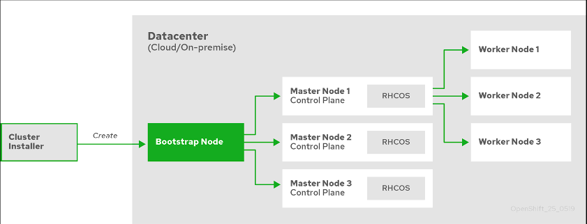
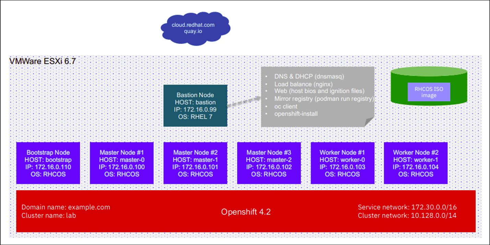

# OpenShift-安装
内容来自学习的IBM在线实验室发布的学习链接：[OpenShift 容器平台简介和离线裸机安装步骤](https://csc.cn.ibm.com/roadmap/index/6cad9db3-bca0-45a8-abbc-c2c6fd38cb60?eventId=5c9e9c67-e55e-483a-a6bb-32f89b1bdc23)
## 安装过程简介
&#8195;&#8195;安装OpenShift Container Platform集群时，可以从Red Hat OpenShift Cluster Manager站点上相应的Infrastructure Provider页面下载安装程序 。该网站管理：
- 帐户的REST API
- 注册表令牌，这是您用于获取必需组件的拉式机密
- 集群注册，它将集群标识与您的Red Hat帐户相关联，以方便收集使用情况指标

&#8195;&#8195;在OpenShift Container Platform 4.6中，安装程序是Go二进制文件，该文件对一组资产执行一系列文件转换。与安装程序交互的方式因安装类型而异。
- 对于具有由安装程序提供的基础结构的集群，您可以将基础结构引导和供应委派给安装程序，而不是自己进行。安装程序将创建支持集群所需的所有网络，机器和操作系统。
- 如果为群集配置和管理基础架构，则必须提供所有群集基础架构和资源，包括引导计算机，网络，负载平衡，存储和单个群集计算机。
     
&#8195;&#8195;在安装期间，使用三组文件：名为的安装配置文件install-config.yaml，Kubernetes清单和适用于用户机器类型的Ignition配置文件。    
&#8195;&#8195;将安装配置文件转换为Kubernetes清单，然后将清单包装到Ignition配置文件中。安装程序使用这些Ignition配置文件来创建集群。运行安装程序时，将删除所有的配置文件，因此请确保备份所有要再次使用的配置文件。
- 构成集群的控制平面和计算机的基础架构
- 负载均衡器
- 群集网络，包括DNS记录和所需的子网
- 集群基础架构和应用程序的存储

## 安装过程详细信息
&#8195;&#8195;由于群集中的每台计算机在配置时都需要有关群集的信息，因此OpenShift容器平台在初始配置期间会使用临时引导计算机将所需信息提供给永久控制平面。它通过使用描述如何创建群集的点火配置文件来启动。引导计算机将创建组成控制平面的主计算机。然后，控制平面计算机创建计算机，也称为工作计算机。下图说明了此过程：    

&#8195;&#8195;集群计算机初始化之后，引导计算机将被销毁。所有群集都使用引导过程来初始化群集，但是，如果为群集配置基础结构，则必须手动完成许多步骤。对群集进行引导涉及以下步骤：
- 导计算机引导并开始托管主计算机引导所需的远程资源。（如果您配置基础架构，则需要人工干预）
- 主计算机从引导计算机获取远程资源并完成引导。（如果您配置基础架构，则需要人工干预）
- 主计算机使用引导计算机来形成etcd集群。
- 引导机器使用新的etcd集群启动临时Kubernetes控制平面。
- 临时控制平面将生产控制平面调度到主机。
- 临时控制平面关闭，并将控制权交给生产控制平面。
- 引导机将OpenShift容器平台组件注入生产控制平面。
- 安装程序将关闭引导计算机。（如果您配置基础架构，则需要人工干预）
- 控制平面设置工作节点。
- 控制平面以一组操作员的形式安装其他服务。

&#8195;&#8195;该引导过程的结果是一个完全运行的OpenShift Container Platform集群。然后，集群下载并配置日常操作所需的其余组件，包括在受支持的环境中创建工作机。

### Openshift Topology

### 离线裸机安装环境要求
安装最小的OpenShift容器平台集群需要以下主机：
- 1个引导计算机
- 3个控制平面或主机
- 2个或更多计算节点
- 1个堡垒

具体如下下表所示：

类型|数量|操作系统|vCPU|内存|硬盘
:---:|:---:|:---:|:---:|:---:|:---:
引导节点Master Nodes|1|RHCOS|4|16GB|120GB
主节点Master Nodes|3|RHCOS|4|16GB|120GB
工作节点Worker Nodes|2|RHCOS or RHEL 7.6+|2|8GB|120GB
堡垒Bastion Node|1|RHEL|2|4GB|25GB

堡垒机的角色：
- DNS和DHCP服务器
- 私有Docker registry
- 负载均衡服务器
- Web服务器
- 执行oc命令的客户端

### Openshift离线Bare metal安装步骤
步骤如下：
- 堡垒机准备：
    - DNS & DHCP:dnsmasq
    - Web服务器：Niginx
    - LB服务器:haproxy
    - Mirror Registry:Registry docker using podman
    - Openshift-install & Oc命令行
- 创建虚拟机（根据需求创建）：
    - 1 bootstrap
    - 3 master
    - 2 worker
    - 1 bastion
- 生成点火文件：使用openshift-install生成的点火文件
- 开始安装：从操作系统引导开始自动安装
- 监视安装完成：观察安装进度，批准证书，配置失败的operator

### 在裸机上部署安装程序置备的集群
&#8195;&#8195;以上内容均摘自IBM在线实验室教程。原版也参考红帽官方《在裸机上部署安装程序置备的集群》和《在 vSphere 上安装》安装手册的基础上，结合了IBM实验室各方同仁在vSphere上以裸机方式安装OpenShift Container Platform的配置经验，尽量简化了安装步骤，屏蔽了安装过程中各种可能导致安装失败的配置错误,以更加贴近生产集群部署实践的方式体验OpenShift Container Platform安装过程。

相关链接如下：
在裸机上部署安装程序置备的集群：[在裸机上部署安装程序置备的集群](https://access.redhat.com/documentation/zh-cn/openshift_container_platform/4.6/html/deploying_installer-provisioned_clusters_on_bare_metal/index?_ga=2.241581835.845499386.1613305155-1408166508.1612514124)     
在vSphere上安装：[安装 OpenShift Container Platform vSphere 集群](https://access.redhat.com/documentation/zh-cn/openshift_container_platform/4.6/html/installing_on_vsphere/index?_ga=2.44110765.845499386.1613305155-1408166508.1612514124)    
IBM上机实验地址：[Openshift container Platfom (OCP) bare metal installation](https://csc.cn.ibm.com/src/index/425ebe3f-163d-4bd2-8ffd-a3770f9f5162?rtype=experiment&roadmapId=6cad9db3-bca0-45a8-abbc-c2c6fd38cb60&eventId=5c9e9c67-e55e-483a-a6bb-32f89b1bdc23)
